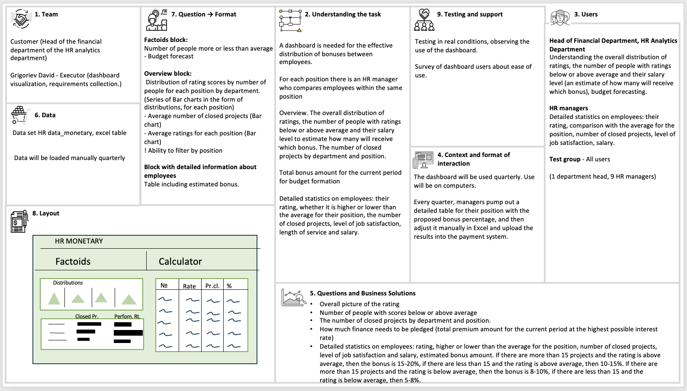

# Development of an HR Dashboard

[Link to the project in Tableau public](https://public.tableau.com/app/profile/david.grigorev/viz/HRmonetary-KarpovProject/HRmonetaryDashboard)

### Task Description: Development of an HR Dashboard

**Background:** Company is engaged in the sales of products. However, for the purpose of this dashboard project, the nature of our business is not relevant. The primary user of this dashboard will be the head of the finance department within the HR analytics team. A key responsibility of this role is the efficient allocation of bonuses among employees.

**Objective:** To facilitate the effective distribution of bonuses, it is necessary to identify eligible employees based on their performance. Each position has a designated HR manager responsible for comparing employees' performances within the same job title.

**Performance Metrics:** The main metric for assessing employee performance is the performance rating, which ranges from 1 to 4: 1 signifies poor performance, 2 meets expectations, 3 exceeds expectations, and 4 represents outstanding results. Based on this rating, the percentage of the salary awarded as a bonus is determined. Employees with a rating below the average for their position receive a 5-10% bonus of their annual income, whereas those above average receive a 10-20% bonus. Employees with a rating of 1 are not eligible for a bonus but are offered free corporate training to help improve their performance. The precise bonus percentage within these ranges is further refined by analyzing the number of projects completed during the work period. Employees who have completed 15 or more projects receive an 8-10% bonus if their performance rating is below average and a 15-20% bonus if above average. The comparison is considered valid across positions as projects are approximately equivalent in value.

**Final Decision:** The HR manager individually determines the final bonus percentage for each employee. Therefore, in deciding on the bonus allocation, factors such as self-assessed job satisfaction, tenure, and salary level are also considered. There is no fixed algorithm for this decision-making process; it is at the discretion of each HR manager.

**Dashboard Requirements:** 
- The dashboard should provide an overview of the distribution of performance ratings, the number of people with ratings below or above average, and their salary levels to estimate the potential bonuses allocated.
- It should offer insights into employee performance through an overview of the number of projects completed by department and position.
- The capability to forecast the budget for the next year based on the total bonus amount for the current period, according to the maximum possible percentage under the rules specified, is crucial.
- A calculator to estimate the bonus budget when adjusting the percentage ranges of the bonuses is needed.
- Managers require detailed statistics on employees: their rating, whether it is above or below the average for their position, the number of projects completed, job satisfaction levels, and salary. They should be able to download a detailed table for their profession with the proposed bonus percentage, adjust it manually in Excel, and upload the results into the payment system.

**User and Usage:** The dashboard will be used by the department head and their subordinates quarterly on computers. Currently, the task is performed by analysts who extract Excel data on employees, which is then filtered and analyzed to identify candidates for bonuses. This process is time-consuming and not all employees are proficient in creating pivot tables and graphs.

**Development Goal:** Develop a dashboard that addresses the outlined requirements, streamlining the bonus allocation process and reducing the dependency on manual data manipulation and analysis.

### Dashboard Canvas

### [Raw Data Description]()

| Name                   | Description                                                              | Column Types       |
|------------------------|--------------------------------------------------------------------------|--------------------|
| Age                    | Age                                                                      | Integer            |
| BusinessTravel         | Category of business trip frequency (frequent or not frequent)            | Categorical        |
| Department             | Department where the employee is listed                                  | Categorical        |
| DistanceFromHome       | Distance between home and office in kilometers                           | Integer            |
| EducationField         | Field of education                                                       | Categorical        |
| EmployeeCount          | Column for calculating the total number of employees                     | Integer            |
| EmployeeNumber         | Employee ID                                                              | Integer            |
| Gender                 | Gender (male, female)                                                    | Categorical        |
| PerformanceRating      | Performance rating of the employee (1-4, where 4 is excellent)           | Integer            |
| JobRole                | Job position                                                             | Categorical        |
| JobSatisfaction        | Level of job satisfaction (1-4, where 4 is very satisfied)               | Integer            |
| MaritalStatus          | Marital status                                                           | Categorical        |
| MonthlyIncome          | Monthly income                                                           | Integer            |
| NumCompaniesWorked     | Number of companies the employee has worked at previously                | Integer            |
| ProjectsClosed         | Number of projects closed in a year                                      | Integer            |
| TotalWorkingYears      | Total number of years of work experience                                 | Integer            |
| TrainingTimesLastYear  | Number of hours of skills development last year                          | Integer            |
| WorkLifeBalance        | Level of satisfaction with work-life balance (1-4, where 4 is excellent) | Integer            |
| YearsAtCompany         | Number of years at the company                                           | Integer            |
| YearsInCurrentRole     | Number of years in the current role                                      | Integer            |
| YearsSinceLastPromotion| Number of years since the last promotion                                 | Integer            |
| YearsWithCurrManager   | Number of years with the current manager                                 | Integer            |

### [Dashboard](https://public.tableau.com/app/profile/david.grigorev/viz/HRmonetary-KarpovProject/HRmonetaryDashboard)

