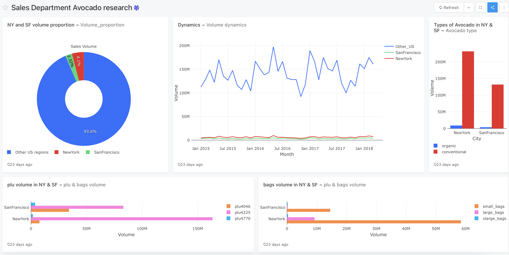

# USA Avocado Sales Analysis

## Project Overview

This project aims to provide insightful analytics for the avocado sales department in the USA, focusing on sales in the San Francisco and New York regions. By comparing these regions with overall US sales indicators, this analysis reveals the volume of sales and its dynamics, compares year-to-year indicators, and highlights the most popular types of avocados and packaging. The dashboard created for this analysis serves as a comprehensive tool for visualizing these comparisons and trends.

[View the Dashboard Here](http://redash.lab.karpov.courses/public/dashboards/WPi05JdtZSaOiKqUsdSCPSlTrcSaINfllY6aZYQ6?org_slug=default)

## Data Description

The dataset contains the following columns:

- **date**: Date of the record
- **average_price**: The average price of one avocado
- **total_volume**: The number of avocados sold
- **plu4046**, **plu4225**, **plu4770**: The number of avocados sold with respective PLU codes
- **total_bags**, **small_bags**, **large_bags**, **xlarge_bags**: Total and categorized numbers of bags
- **type**: Type of avocado (Conventional or Organic)
- **year**: Year of the record
- **region**: The city or region of the observation

## Analyses and Insights

### 1. NY and SF Volume Proportion

Analyzing the volume of avocado sales in New York and San Francisco compared to other US regions. 

- **Query:** Provided SQL query calculates the total sales volume for these specific regions and contrasts it with the total US sales volume.
- **Outcome:** Visualization shows a clear distribution between the sales in New York, San Francisco, and other regions, illustrating their market share within the country.

### 2. Volume Dynamics

Exploring how avocado sales volumes change over time across different regions.

- **Query:** Monthly sales volumes for New York, San Francisco, and the rest of the US are aggregated to understand seasonal and yearly trends.
- **Outcome:** The resulting visualization tracks the sales volume dynamics, highlighting seasonal peaks and troughs across the regions.

### 3. Types of Avocado in NY & SF

Comparing the popularity of organic vs. conventional avocados in New York and San Francisco.

- **Query:** Sales volumes for each avocado type are aggregated by region.
- **Outcome:** Visualization showcases the preference for avocado types in these metropolitan areas.

### 4. PLU & Bags Volume

Investigating the sales distribution across different PLU codes and bag sizes in New York and San Francisco.

- **Query:** Aggregates sales data by PLU code and bag size for detailed insights into consumer preferences.
- **Outcome:** The visualizations highlight which PLUs and bag sizes are more popular in the targeted regions.

## Final Dashboard

The dashboard consolidates all the insights and visualizations into a single interface, providing the sales department with a comprehensive tool for monitoring, analyzing, and making informed decisions about avocado sales strategies in the United States.

## Conclusion

This project provides valuable insights into the avocado sales landscape in the United States, focusing on key markets in New York and San Francisco. The detailed analysis and visualizations offer a clear view of sales dynamics, preferences, and trends that can assist the sales department in strategizing and optimizing their operations.
