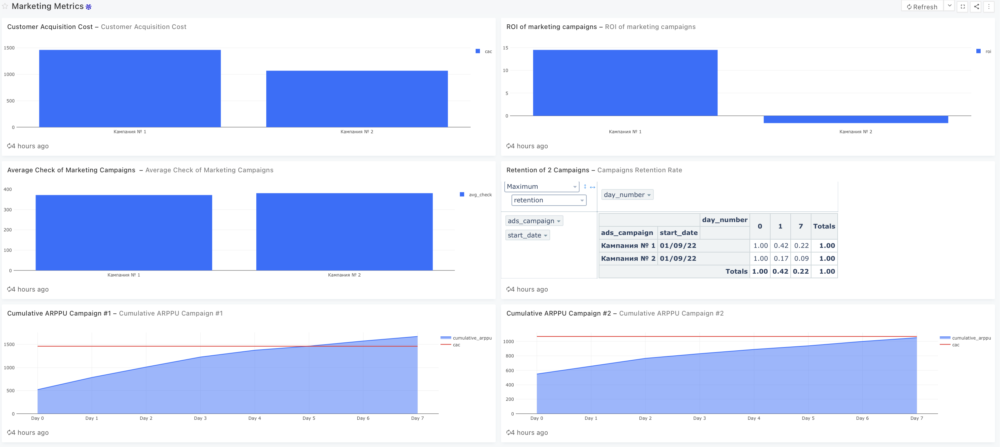
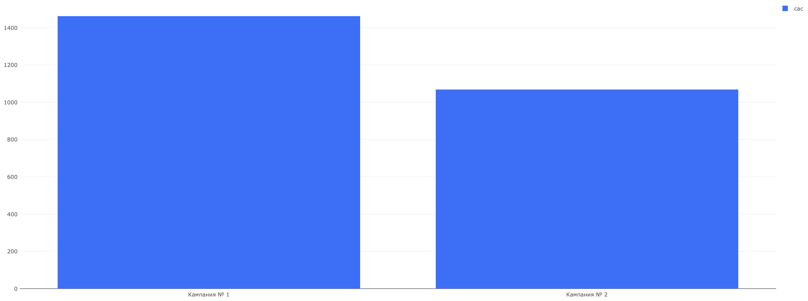
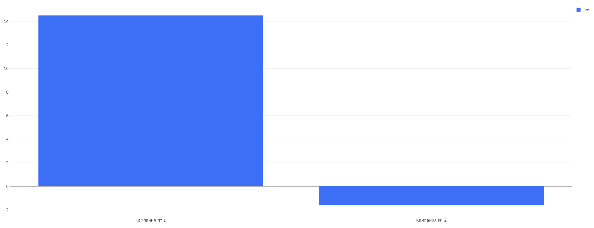
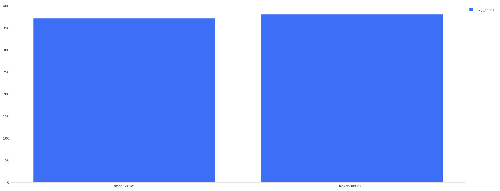
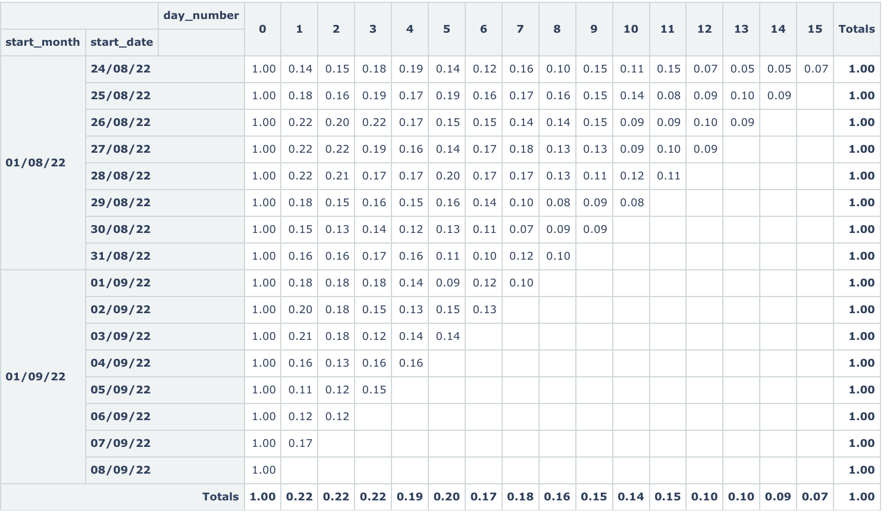
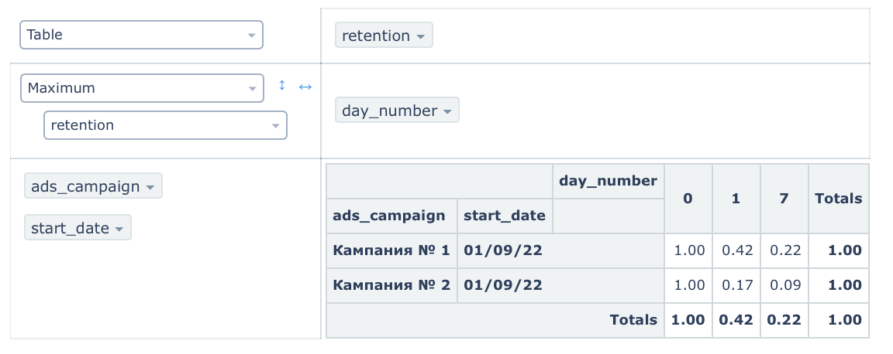
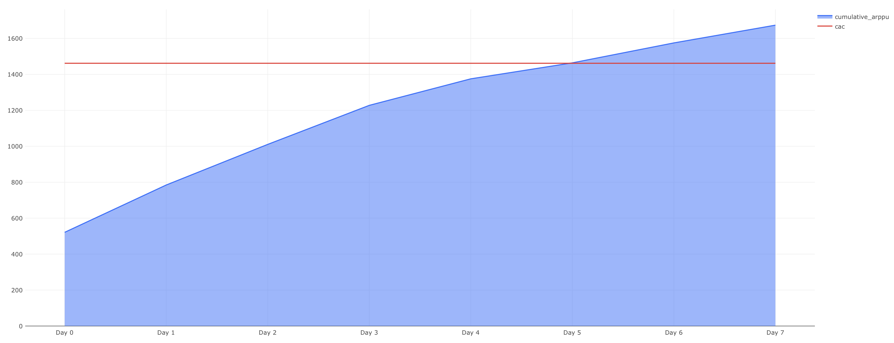
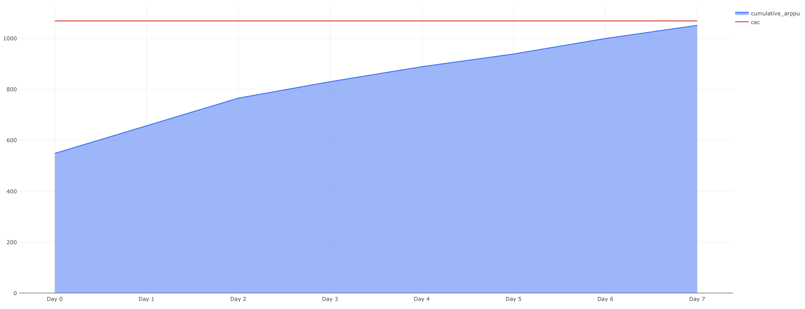

# Маркетинговые метрики

## Overview
Документ посвящен анализу ключевых маркетинговых метрик для двух рекламных кампаний, направленных на привлечение новых пользователей. Включает в себя оценку стоимости привлечения клиента (CAC) и сравнение эффективности интеграции с известным блогером на YouTube против таргетированной рекламы в социальных сетях. Обе кампании имели одинаковый бюджет, что позволяет оценить их результативность в равных условиях. Анализ подкрепляется дашбордом, предоставляющим визуализацию данных по привлеченным пользователям и затратам на каждую кампанию. Документ служит важным инструментом для маркетологов и руководителей для оптимизации рекламных бюджетов и стратегий.

## Link to the Dashboard
[Ссылка для просмотра дашборда в Redash](http://redash.public.karpov.courses/public/dashboards/7ptMANOaswVd4QvBq5E0oIVbO5y61slGkWFjSfj1?org_slug=default)

<details>
<summary>Просмотр Дашборда прямо здесь</summary>
  

</details>

## Задача 1. Анализ затрат на привлечение клиентов (CAC) для двух рекламных кампаний

<details>
<summary>Описание задачи</summary>
Оцениваем стоимость привлечения одного пользователя (CAC) для двух различных рекламных кампаний, чтобы определить, какая из них оказалась более эффективной с точки зрения затрат.

- **Кампания № 1**: Интеграция с известным блогером на YouTube.
- **Кампания № 2**: Таргетированная реклама в социальных сетях.

Обе кампании имели одинаковый бюджет в размере 250,000 рублей.

Список id пользователей, пришедших после рекламной кампании № 1:

8631, 8632, 8638, 8643, 8657, 8673, 8706, 8707, 8715, 8723, 8732, 8739, 8741, 
8750, 8751, 8752, 8770, 8774, 8788, 8791, 8804, 8810, 8815, 8828, 8830, 8845, 
8853, 8859, 8867, 8869, 8876, 8879, 8883, 8896, 8909, 8911, 8933, 8940, 8972, 
8976, 8988, 8990, 9002, 9004, 9009, 9019, 9020, 9035, 9036, 9061, 9069, 9071, 
9075, 9081, 9085, 9089, 9108, 9113, 9144, 9145, 9146, 9162, 9165, 9167, 9175, 
9180, 9182, 9197, 9198, 9210, 9223, 9251, 9257, 9278, 9287, 9291, 9313, 9317, 
9321, 9334, 9351, 9391, 9398, 9414, 9420, 9422, 9431, 9450, 9451, 9454, 9472, 
9476, 9478, 9491, 9494, 9505, 9512, 9518, 9524, 9526, 9528, 9531, 9535, 9550, 
9559, 9561, 9562, 9599, 9603, 9605, 9611, 9612, 9615, 9625, 9633, 9652, 9654, 
9655, 9660, 9662, 9667, 9677, 9679, 9689, 9695, 9720, 9726, 9739, 9740, 9762, 
9778, 9786, 9794, 9804, 9810, 9813, 9818, 9828, 9831, 9836, 9838, 9845, 9871, 
9887, 9891, 9896, 9897, 9916, 9945, 9960, 9963, 9965, 9968, 9971, 9993, 9998, 
9999, 10001, 10013, 10016, 10023, 10030, 10051, 10057, 10064, 10082, 10103, 
10105, 10122, 10134, 

Список id пользователей, пришедших после рекламной кампании № 2:

8629, 8630, 8644, 8646, 8650, 8655, 8659, 8660, 8663, 8665, 8670, 8675, 8680, 8681, 
8682, 8683, 8694, 8697, 8700, 8704, 8712, 8713, 8719, 8729, 8733, 8742, 8748, 8754, 
8771, 8794, 8795, 8798, 8803, 8805, 8806, 8812, 8814, 8825, 8827, 8838, 8849, 8851, 
8854, 8855, 8870, 8878, 8882, 8886, 8890, 8893, 8900, 8902, 8913, 8916, 8923, 8929, 
8935, 8942, 8943, 8949, 8953, 8955, 8966, 8968, 8971, 8973, 8980, 8995, 8999, 9000, 
9007, 9013, 9041, 9042, 9047, 9064, 9068, 9077, 9082, 9083, 9095, 9103, 9109, 9117, 
9123, 9127, 9131, 9137, 9140, 9149, 9161, 9179, 9181, 9183, 9185, 9190, 9196, 9203, 
9207, 9226, 9227, 9229, 9230, 9231, 9250, 9255, 9259, 9267, 9273, 9281, 9282, 9289, 
9292, 9303, 9310, 9312, 9315, 9327, 9333, 9335, 9337, 9343, 9356, 9368, 9370, 9383, 
9392, 9404, 9410, 9421, 9428, 9432, 9437, 9468, 9479, 9483, 9485, 9492, 9495, 9497, 
9498, 9500, 9510, 9527, 9529, 9530, 9538, 9539, 9545, 9557, 9558, 9560, 9564, 9567, 
9570, 9591, 9596, 9598, 9616, 9631, 9634, 9635, 9636, 9658, 9666, 9672, 9684, 9692, 
9700, 9704, 9706, 9711, 9719, 9727, 9735, 9741, 9744, 9749, 9752, 9753, 9755, 9757, 
9764, 9783, 9784, 9788, 9790, 9808, 9820, 9839, 9841, 9843, 9853, 9855, 9859, 9863, 
9877, 9879, 9880, 9882, 9883, 9885, 9901, 9904, 9908, 9910, 9912, 9920, 9929, 9930, 
9935, 9939, 9958, 9959, 9961, 9983, 10027, 10033, 10038, 10045, 10047, 10048, 10058, 
10059, 10067, 10069, 10073, 10075, 10078, 10079, 10081, 10092, 10106, 10110, 10113, 10131

Колонку с наименованиями кампаний назовите ads_campaign, а колонку со значением метрики — cac.
</details>

<details>
<summary>SQL запрос</summary>
  
```sql
SELECT ads_campaign, ROUND(250000 / COUNT(DISTINCT user_id)::DECIMAL, 2) AS cac
FROM
(SELECT user_id, order_id, action,
CASE
WHEN user_id IN (8631, 8632, 8638, 8643, 8657, 8673, 8706, 8707, 8715, 8723, 8732, 8739, 8741, 8750, 8751, 8752, 8770, 8774, 8788, 8791, 8804, 8810, 8815, 8828, 8830, 8845, 
8853, 8859, 8867, 8869, 8876, 8879, 8883, 8896, 8909, 8911, 8933, 8940, 8972, 8976, 8988, 8990, 9002, 9004, 9009, 9019, 9020, 9035, 9036, 9061, 9069, 9071, 
9075, 9081, 9085, 9089, 9108, 9113, 9144, 9145, 9146, 9162, 9165, 9167, 9175, 9180, 9182, 9197, 9198, 9210, 9223, 9251, 9257, 9278, 9287, 9291, 9313, 9317, 
9321, 9334, 9351, 9391, 9398, 9414, 9420, 9422, 9431, 9450, 9451, 9454, 9472, 9476, 9478, 9491, 9494, 9505, 9512, 9518, 9524, 9526, 9528, 9531, 9535, 9550, 
9559, 9561, 9562, 9599, 9603, 9605, 9611, 9612, 9615, 9625, 9633, 9652, 9654, 9655, 9660, 9662, 9667, 9677, 9679, 9689, 9695, 9720, 9726, 9739, 9740, 9762, 
9778, 9786, 9794, 9804, 9810, 9813, 9818, 9828, 9831, 9836, 9838, 9845, 9871, 9887, 9891, 9896, 9897, 9916, 9945, 9960, 9963, 9965, 9968, 9971, 9993, 9998, 
9999, 10001, 10013, 10016, 10023, 10030, 10051, 10057, 10064, 10082, 10103, 10105, 10122, 10134, 10135) THEN 'Кампания № 1'
WHEN user_id IN (8629, 8630, 8644, 8646, 8650, 8655, 8659, 8660, 8663, 8665, 8670, 8675, 8680, 8681, 
8682, 8683, 8694, 8697, 8700, 8704, 8712, 8713, 8719, 8729, 8733, 8742, 8748, 8754, 
8771, 8794, 8795, 8798, 8803, 8805, 8806, 8812, 8814, 8825, 8827, 8838, 8849, 8851, 
8854, 8855, 8870, 8878, 8882, 8886, 8890, 8893, 8900, 8902, 8913, 8916, 8923, 8929, 
8935, 8942, 8943, 8949, 8953, 8955, 8966, 8968, 8971, 8973, 8980, 8995, 8999, 9000, 
9007, 9013, 9041, 9042, 9047, 9064, 9068, 9077, 9082, 9083, 9095, 9103, 9109, 9117, 
9123, 9127, 9131, 9137, 9140, 9149, 9161, 9179, 9181, 9183, 9185, 9190, 9196, 9203, 
9207, 9226, 9227, 9229, 9230, 9231, 9250, 9255, 9259, 9267, 9273, 9281, 9282, 9289, 
9292, 9303, 9310, 9312, 9315, 9327, 9333, 9335, 9337, 9343, 9356, 9368, 9370, 9383, 
9392, 9404, 9410, 9421, 9428, 9432, 9437, 9468, 9479, 9483, 9485, 9492, 9495, 9497, 
9498, 9500, 9510, 9527, 9529, 9530, 9538, 9539, 9545, 9557, 9558, 9560, 9564, 9567, 
9570, 9591, 9596, 9598, 9616, 9631, 9634, 9635, 9636, 9658, 9666, 9672, 9684, 9692, 
9700, 9704, 9706, 9711, 9719, 9727, 9735, 9741, 9744, 9749, 9752, 9753, 9755, 9757, 
9764, 9783, 9784, 9788, 9790, 9808, 9820, 9839, 9841, 9843, 9853, 9855, 9859, 9863, 
9877, 9879, 9880, 9882, 9883, 9885, 9901, 9904, 9908, 9910, 9912, 9920, 9929, 9930, 
9935, 9939, 9958, 9959, 9961, 9983, 10027, 10033, 10038, 10045, 10047, 10048, 10058, 
10059, 10067, 10069, 10073, 10075, 10078, 10079, 10081, 10092, 10106, 10110, 10113, 10131) THEN 'Кампания № 2'
ELSE 'other'
END AS ads_campaign
FROM user_actions) t1
WHERE order_id NOT IN (SELECT order_id FROM user_actions WHERE action = 'cancel_order') AND ads_campaign IN ('Кампания № 1', 'Кампания № 2')
GROUP BY ads_campaign
ORDER BY ads_campaign
```
</details>

<details>
<summary>Результат выполнения запрос</summary>

| ads_campaign   | cac         |
|----------------|-------------|
| Кампания № 1   | 1,461.99    |
| Кампания № 2   | 1,068.38    |

</details>

<details>
<summary> Визуализация данных</summary>
  

  
</details>


## Задача 2. Анализ возврата инвестиций (ROI) для двух рекламных кампаний

<details>
<summary>Описание задачи</summary>
Оцениваем ROI (Return on Investment) для двух рекламных кампаний, чтобы определить, какая из них оказалась более рентабельной с точки зрения окупаемости инвестиций.

- **Кампания № 1**: Интеграция с известным блогером на YouTube.
- **Кампания № 2**: Таргетированная реклама в социальных сетях.

Исследуем, сколько прибыли принес каждый вложенный рубль в рекламные кампании.
</details>

<details>
<summary>SQL запрос</summary>
  
```sql
WITH comapin_orders AS
(SELECT user_id, order_id, action, ads_campaign
FROM
(SELECT user_id, order_id, action,
CASE
WHEN user_id IN (8631, 8632, 8638, 8643, 8657, 8673, 8706, 8707, 8715, 8723, 8732, 8739, 8741, 8750, 8751, 8752, 8770, 8774, 8788, 8791, 8804, 8810, 8815, 8828, 8830, 8845, 
8853, 8859, 8867, 8869, 8876, 8879, 8883, 8896, 8909, 8911, 8933, 8940, 8972, 8976, 8988, 8990, 9002, 9004, 9009, 9019, 9020, 9035, 9036, 9061, 9069, 9071, 
9075, 9081, 9085, 9089, 9108, 9113, 9144, 9145, 9146, 9162, 9165, 9167, 9175, 9180, 9182, 9197, 9198, 9210, 9223, 9251, 9257, 9278, 9287, 9291, 9313, 9317, 
9321, 9334, 9351, 9391, 9398, 9414, 9420, 9422, 9431, 9450, 9451, 9454, 9472, 9476, 9478, 9491, 9494, 9505, 9512, 9518, 9524, 9526, 9528, 9531, 9535, 9550, 
9559, 9561, 9562, 9599, 9603, 9605, 9611, 9612, 9615, 9625, 9633, 9652, 9654, 9655, 9660, 9662, 9667, 9677, 9679, 9689, 9695, 9720, 9726, 9739, 9740, 9762, 
9778, 9786, 9794, 9804, 9810, 9813, 9818, 9828, 9831, 9836, 9838, 9845, 9871, 9887, 9891, 9896, 9897, 9916, 9945, 9960, 9963, 9965, 9968, 9971, 9993, 9998, 
9999, 10001, 10013, 10016, 10023, 10030, 10051, 10057, 10064, 10082, 10103, 10105, 10122, 10134, 10135) THEN 'Кампания № 1'
WHEN user_id IN (8629, 8630, 8644, 8646, 8650, 8655, 8659, 8660, 8663, 8665, 8670, 8675, 8680, 8681, 
8682, 8683, 8694, 8697, 8700, 8704, 8712, 8713, 8719, 8729, 8733, 8742, 8748, 8754, 
8771, 8794, 8795, 8798, 8803, 8805, 8806, 8812, 8814, 8825, 8827, 8838, 8849, 8851, 
8854, 8855, 8870, 8878, 8882, 8886, 8890, 8893, 8900, 8902, 8913, 8916, 8923, 8929, 
8935, 8942, 8943, 8949, 8953, 8955, 8966, 8968, 8971, 8973, 8980, 8995, 8999, 9000, 
9007, 9013, 9041, 9042, 9047, 9064, 9068, 9077, 9082, 9083, 9095, 9103, 9109, 9117, 
9123, 9127, 9131, 9137, 9140, 9149, 9161, 9179, 9181, 9183, 9185, 9190, 9196, 9203, 
9207, 9226, 9227, 9229, 9230, 9231, 9250, 9255, 9259, 9267, 9273, 9281, 9282, 9289, 
9292, 9303, 9310, 9312, 9315, 9327, 9333, 9335, 9337, 9343, 9356, 9368, 9370, 9383, 
9392, 9404, 9410, 9421, 9428, 9432, 9437, 9468, 9479, 9483, 9485, 9492, 9495, 9497, 
9498, 9500, 9510, 9527, 9529, 9530, 9538, 9539, 9545, 9557, 9558, 9560, 9564, 9567, 
9570, 9591, 9596, 9598, 9616, 9631, 9634, 9635, 9636, 9658, 9666, 9672, 9684, 9692, 
9700, 9704, 9706, 9711, 9719, 9727, 9735, 9741, 9744, 9749, 9752, 9753, 9755, 9757, 
9764, 9783, 9784, 9788, 9790, 9808, 9820, 9839, 9841, 9843, 9853, 9855, 9859, 9863, 
9877, 9879, 9880, 9882, 9883, 9885, 9901, 9904, 9908, 9910, 9912, 9920, 9929, 9930, 
9935, 9939, 9958, 9959, 9961, 9983, 10027, 10033, 10038, 10045, 10047, 10048, 10058, 
10059, 10067, 10069, 10073, 10075, 10078, 10079, 10081, 10092, 10106, 10110, 10113, 10131) THEN 'Кампания № 2'
ELSE 'other'
END AS ads_campaign
FROM user_actions) t1
WHERE ads_campaign IN ('Кампания № 1', 'Кампания № 2') AND order_id NOT IN (SELECT order_id FROM user_actions WHERE action = 'cancel_order')),

price_info AS
(SELECT order_id, SUM(price) AS order_price
FROM
(SELECT order_id, unnest(product_ids) AS product_id
FROM orders) exploded
LEFT JOIN products
USING(product_id)
GROUP BY order_id)

SELECT ads_campaign, ROUND(((SUM(order_price)-250000)::DECIMAL/250000)*100, 2) AS roi
FROM comapin_orders
LEFT JOIN price_info
USING(order_id)
GROUP BY ads_campaign
ORDER BY 2 DESC
```
</details>

<details>
<summary>Результат выполнения запрос</summary>

| ads_campaign   | roi         |
|----------------|-------------|
| Кампания № 1   | 14.50%      |
| Кампания № 2   | -1.61%      |

</details>

<details>
<summary> Визуализация данных</summary>
  

  
</details>


## Задача 3. Анализ средней стоимости заказа привлечённых пользователей за первую неделю использования приложения

<details>
<summary>Описание задачи</summary>
Оцениваем среднюю стоимость заказа для пользователей, привлечённых через две разные рекламные кампании, за первую неделю использования приложения (с 1 по 7 сентября 2022 года).

</details>

<details>
<summary>SQL запрос</summary>
  
```sql
WITH campaign_info AS (
    SELECT user_id, order_id, action, ads_campaign, time
    FROM (
        SELECT user_id, order_id, action, time,
        CASE
            WHEN user_id IN (8631, 8632, 8638, 8643, 8657, 8673, 8706, 8707, 8715, 8723, 8732, 8739, 8741, 8750, 8751, 8752, 8770, 8774, 8788, 8791, 8804, 8810, 8815, 8828, 8830, 8845, 
            8853, 8859, 8867, 8869, 8876, 8879, 8883, 8896, 8909, 8911, 8933, 8940, 8972, 8976, 8988, 8990, 9002, 9004, 9009, 9019, 9020, 9035, 9036, 9061, 9069, 9071, 
            9075, 9081, 9085, 9089, 9108, 9113, 9144, 9145, 9146, 9162, 9165, 9167, 9175, 9180, 9182, 9197, 9198, 9210, 9223, 9251, 9257, 9278, 9287, 9291, 9313, 9317, 
            9321, 9334, 9351, 9391, 9398, 9414, 9420, 9422, 9431, 9450, 9451, 9454, 9472, 9476, 9478, 9491, 9494, 9505, 9512, 9518, 9524, 9526, 9528, 9531, 9535, 9550, 
            9559, 9561, 9562, 9599, 9603, 9605, 9611, 9612, 9615, 9625, 9633, 9652, 9654, 9655, 9660, 9662, 9667, 9677, 9679, 9689, 9695, 9720, 9726, 9739, 9740, 9762, 
            9778, 9786, 9794, 9804, 9810, 9813, 9818, 9828, 9831, 9836, 9838, 9845, 9871, 9887, 9891, 9896, 9897, 9916, 9945, 9960, 9963, 9965, 9968, 9971, 9993, 9998, 
            9999, 10001, 10013, 10016, 10023, 10030, 10051, 10057, 10064, 10082, 10103, 10105, 10122, 10134, 10135) THEN 'Кампания № 1'
            WHEN user_id IN (8629, 8630, 8644, 8646, 8650, 8655, 8659, 8660, 8663, 8665, 8670, 8675, 8680, 8681, 
            8682, 8683, 8694, 8697, 8700, 8704, 8712, 8713, 8719, 8729, 8733, 8742, 8748, 8754, 
            8771,

 8794, 8795, 8798, 8803, 8805, 8806, 8812, 8814, 8825, 8827, 8838, 8849, 8851, 
            8854, 8855, 8870, 8878, 8882, 8886, 8890, 8893, 8900, 8902, 8913, 8916, 8923, 8929, 
            8935, 8942, 8943, 8949, 8953, 8955, 8966, 8968, 8971, 8973, 8980, 8995, 8999, 9000, 
            9007, 9013, 9041, 9042, 9047, 9064, 9068, 9077, 9082, 9083, 9095, 9103, 9109, 9117, 
            9123, 9127, 9131, 9137, 9140, 9149, 9161, 9179, 9181, 9183, 9185, 9190, 9196, 9203, 
            9207, 9226, 9227, 9229, 9230, 9231, 9250, 9255, 9259, 9267, 9273, 9281, 9282, 9289, 
            9292, 9303, 9310, 9312, 9315, 9327, 9333, 9335, 9337, 9343, 9356, 9368, 9370, 9383, 
            9392, 9404, 9410, 9421, 9428, 9432, 9437, 9468, 9479, 9483, 9485, 9492, 9495, 9497, 
            9498, 9500, 9510, 9527, 9529, 9530, 9538, 9539, 9545, 9557, 9558, 9560, 9564, 9567, 
            9570, 9591, 9596, 9598, 9616, 9631, 9634, 9635, 9636, 9658, 9666, 9672, 9684, 9692, 
            9700, 9704, 9706, 9711, 9719, 9727, 9735, 9741, 9744, 9749, 9752, 9753, 9755, 9757, 
            9764, 9783, 9784, 9788, 9790, 9808, 9820, 9839, 9841, 9843, 9853, 9855, 9859, 9863, 
            9877, 9879, 9880, 9882, 9883, 9885, 9901, 9904, 9908, 9910, 9912, 9920, 9929, 9930, 
            9935, 9939, 9958, 9959, 9961, 9983, 10027, 10033, 10038, 10045, 10047, 10048, 10058, 
            10059, 10067, 10069, 10073, 10075, 10078, 10079, 10081, 10092, 10106, 10110, 10113, 10131) THEN 'Кампания № 2'
            ELSE 'other'
        END AS ads_campaign
    FROM user_actions
    WHERE time BETWEEN '2022-09-01' AND '2022-09-07' AND order_id NOT IN (SELECT order_id FROM user_actions WHERE action = 'cancel_order')
    AND user_id IN (SELECT user_id FROM user_actions WHERE action = 'create_user')
) t1
WHERE ads_campaign IN ('Кампания № 1', 'Кампания № 2')
),

price_info AS (
    SELECT order_id, SUM(price) AS order_price
    FROM (
        SELECT order_id, unnest(product_ids) AS product_id
        FROM orders
    ) exploded
    LEFT JOIN products
    USING(product_id)
    GROUP BY order_id


)

SELECT ads_campaign, ROUND(AVG(order_price), 2) AS avg_check
FROM campaign_info
LEFT JOIN price_info USING(order_id)
GROUP BY ads_campaign
ORDER BY avg_check DESC
```
</details>


<details>
<summary>Результат выполнения запрос</summary>

| ads_campaign  | avg_check |
|---------------|-----------|
| Кампания № 1  | 371.73    |
| Кампания № 2  | 380.88    |

</details>

<details>
<summary> Визуализация данных</summary>
  

  
</details>


## Задача 4. Анализ дневного Retention по когортам

<details>
<summary>Описание задачи</summary>
На основе данных в таблице `user_actions` рассчитайте показатель дневного Retention для всех пользователей, разбив их на когорты по дате первого взаимодействия с нашим приложением. В результат включите четыре колонки: месяц первого взаимодействия, дату первого взаимодействия, количество дней, прошедших с даты первого взаимодействия, и само значение Retention. 
</details>
  
<details>
<summary><strong>SQL запрос</strong></summary>

```sql
SELECT start_date, 
DATE_TRUNC('month', start_date)::DATE AS start_month, date - start_date AS day_number,
ROUND(COUNT(DISTINCT user_id)::DECIMAL / MAX(COUNT(DISTINCT user_id)) OVER(PARTITION BY start_date), 2) AS retention
FROM
(SELECT user_id, time::DATE AS date, MIN(time::DATE) OVER(PARTITION BY user_id) AS start_date
FROM user_actions) t1
GROUP BY date, start_date
ORDER BY start_date, date-start_date
```

</details>

<details>
<summary><strong>Результат выполнения запроса</strong></summary>

| start_month | start_date | day_number | retention |
|-------------|------------|------------|-----------|
| 01/08/22    | 24/08/22   | 0          | 1.00      |
| 01/08/22    | 24/08/22   | 1          | 0.14      |
| 01/08/22    | 24/08/22   | 2          | 0.15      |
| 01/08/22    | 24/08/22   | 3          | 0.18      |
| 01/08/22    | 24/08/22   | 4          | 0.19      |
| 01/08/22    | 24/08/22   | 5          | 0.14      |
| 01/08/22    | 24/08/22   | 6          | 0.12      |
| 01/08/22    | 24/08/22   | 7          | 0.16      |
| 01/08/22    | 24/08/22   | 8          | 0.10      |
| 01/08/22    | 24/08/22   | 9          | 0.15      |
| ...         | ...        | ...        | ...       |

</details>

<details>
<summary> Визуализация данных</summary>
  

  
</details>


## Задача 5: Анализ Retention для рекламных кампаний

<details>
<summary>Описание задачи</summary>
Для каждой рекламной кампании рассчитайте Retention 1-го и 7-го дня у привлечённых пользователей. Исследуйте активность пользователей, привлеченных через различные каналы рекламы, для понимания качества вовлечения в зависимости от источника.

</details>


<details>
<summary><strong>SQL запрос</strong></summary>

```sql
WITH compaign_info AS
(SELECT user_id, order_id, action, ads_campaign, time
FROM
(SELECT user_id, order_id, action, time,
CASE
WHEN user_id IN (8631, 8632, 8638, 8643, 8657, 8673, 8706, 8707, 8715, 8723, 8732, 8739, 8741, 8750, 8751, 8752, 8770, 8774, 8788, 8791, 8804, 8810, 8815, 8828, 8830, 8845, 
8853, 8859, 8867, 8869, 8876, 8879, 8883, 8896, 8909, 8911, 8933, 8940, 8972, 8976, 8988, 8990, 9002, 9004, 9009, 9019, 9020, 9035, 9036, 9061, 9069, 9071, 
9075, 9081, 9085, 9089, 9108, 9113, 9144, 9145, 9146, 9162, 9165, 9167, 9175, 9180, 9182, 9197, 9198, 9210, 9223, 9251, 9257, 9278, 9287, 9291, 9313, 9317, 
9321, 9334, 9351, 9391, 9398, 9414, 9420, 9422, 9431, 9450, 9451, 9454, 9472, 9476, 9478, 9491, 9494, 9505, 9512, 9518, 9524, 9526, 9528, 9531, 9535, 9550, 
9559, 9561, 9562, 9599, 9603, 9605, 9611, 9612, 9615, 9625, 9633, 9652, 9654, 9655, 9660, 9662, 9667, 9677, 9679, 9689, 9695, 9720, 9726, 9739, 9740, 9762, 
9778, 9786, 9794, 9804, 9810, 9813, 9818, 9828, 9831, 9836, 9838, 9845, 9871, 9887, 9891, 9896, 9897, 9916, 9945, 9960, 9963, 9965, 9968, 9971, 9993, 9998, 
9999, 10001, 10013, 10016, 10023, 10030, 10051, 10057, 10064, 10082, 10103, 10105, 10122, 10134, 10135) THEN 'Кампания № 1'
WHEN user_id IN (8629, 8630, 8644, 8646, 8650, 8655, 8659, 8660, 8663, 8665, 8670, 8675, 8680, 8681, 
8682, 8683, 8694, 869

7, 8700, 8704, 8712, 8713, 8719, 8729, 8733, 8742, 8748, 8754, 
8771, 8794, 8795, 8798, 8803, 8805, 8806, 8812, 8814, 8825, 8827, 8838, 8849, 8851, 
8854, 8855, 8870, 8878, 8882, 8886, 8890, 8893, 8900, 8902, 8913, 8916, 8923, 8929, 
8935, 8942, 8943, 8949, 8953, 8955, 8966, 8968, 8971, 8973, 8980, 8995, 8999, 9000, 
9007, 9013, 9041, 9042, 9047, 9064, 9068, 9077, 9082, 9083, 9095, 9103, 9109, 9117, 
9123, 9127, 9131, 9137, 9140, 9149, 9161, 9179, 9181, 9183, 9185, 9190, 9196, 9203, 
9207, 9226, 9227, 9229, 9230, 9231, 9250, 9255, 9259, 9267, 9273, 9281, 9282, 9289, 
9292, 9303, 9310, 9312, 9315, 9327, 9333, 9335, 9337, 9343, 9356, 9368, 9370, 9383, 
9392, 9404, 9410, 9421, 9428, 9432, 9437, 9468, 9479, 9483, 9485, 9492, 9495, 9497, 
9498, 9500, 9510, 9527, 9529, 9530, 9538, 9539, 9545, 9557, 9558, 9560, 9564, 9567, 
9570, 9591, 9596, 9598, 9616, 9631, 9634, 9635, 9636, 9658, 9666, 9672, 9684, 9692, 
9700, 9704, 9706, 9711, 9719, 9727, 9735, 9741, 9744, 9749, 9752, 9753, 9755, 9757, 
9764, 9783, 9784, 9788, 9790, 9808, 9820, 9839, 9841, 9843, 9853, 9855, 9859, 9863, 
9877, 9879, 9880, 9882, 9883, 9885, 9901, 9904, 9908, 9910, 9912, 9920, 9929, 9930, 
9935, 9939, 9958, 9959, 9961, 9983, 10027, 10033, 10038, 10045, 10047, 10048, 10058, 
10059, 10067, 10069, 10073, 10075, 10078, 10079, 10081, 10092, 10106, 10110, 10113, 10131) THEN 'Кампания № 2'
ELSE 'other'
END AS ads_campaign
FROM user_actions) t1
WHERE ads_campaign IN ('Кампания № 1', 'Кампания № 2')), 

tab AS
(SELECT user_id, ads_campaign, MIN(time::DATE) OVER(PARTITION BY user_id) AS start_date, time::DATE AS date
FROM compaign_info)

SELECT start_date, date-start_date AS day_number, ads_campaign,
ROUND(COUNT(DISTINCT user_id)::DECIMAL / MAX(COUNT(DISTINCT user_id)) OVER(PARTITION BY start_date, ads_campaign), 2) AS retention
FROM tab
GROUP BY 1, 2, 3
HAVING date-start_date IN (0, 1, 7)
ORDER BY ads_campaign, date-start_date
```
</details>

<details>
<summary><strong>Результат выполнения запроса</strong></summary>


start_date  | day_number | ads_campaign    | retention
------------|------------|-----------------|----------
01/09/22    | 0          | Кампания № 1    | 1.00
01/09/22    | 1          | Кампания № 1    | 0.42
01/09/22    | 7          | Кампания № 1    | 0.22
01/09/22    | 0          | Кампания № 2    | 1.00
01/09/22    | 1          | Кампания № 2    | 0.17
01/09/22    | 7          | Кампания № 2    | 0.09

</details>

<details>
<summary><strong>Визуализация данных</strong></summary>



</details>


## Задача 6. Сравнение накопительного ARPPU с CAC.

<details>
<summary>Описание задачи</summary>
Рассчитать накопительный ARPPU и сравнить его с CAC для каждой из двух рекламных кампаний, чтобы выяснить, на какой день доход от заказов превысил затраты на привлечение.
Необходимо для каждой рекламной кампании рассчитать следующие метрики:

1. Накопительный ARPPU (Average Revenue Per Paying User) — средняя выручка на платящего пользователя, накопленная за все предыдущие дни.
2. CAC (Customer Acquisition Cost) — затраты на привлечение одного покупателя.

Метрики должны быть представлены для каждого дня начиная с первого взаимодействия покупателя с приложением. Чтобы получить необходимую таблицу, нужно для каждой рекламной кампании для каждого дня посчитать суммарную стоимость заказов пользователей, пришедших по соответствующему каналу, и разделить её на число пользователей, пришедших в нулевой день. В колонке со значением метрики CAC необходимо проставить одно и то же значение для каждого дня. Метрику CAC мы считали на первом шаге.
</details>


<details>
<summary><strong>SQL запрос</strong></summary>

```sql
WITH campaign_info AS (
    SELECT
        user_id,
        order_id,
        time::DATE AS date,
        CASE
            WHEN user_id IN (8631, 8632, 8638, 8643, 8657, 8673, 8706, 8707, 8715, 8723, 8732, 8739, 8741, 8750, 8751, 8752, 8770, 8774, 8788, 8791, 8804, 8810, 8815, 8828, 8830, 8845, 
                8853, 8859, 8867, 8869, 8876, 8879, 8883, 8896, 8909, 8911, 8933, 8940, 8972, 8976, 8988, 8990, 9002, 9004, 9009, 9019, 9020, 9035, 9036, 9061, 9069, 9071, 
                9075, 9081, 9085, 9089, 9108, 9113, 9144, 9145, 9146, 9162, 9165, 9167, 9175, 9180, 9182, 9197, 9198, 9210, 9223, 9251, 9257, 9278, 9287, 9291, 9313, 9317, 
                9321, 9334, 9351, 9391, 9398, 9414, 9420, 9422, 9431, 9450, 9451, 9454, 9472, 9476, 9478, 9491, 9494, 9505, 9512, 9518, 9524, 9526, 9528, 9531, 9535, 9550, 
                9559, 9561, 9562, 9599, 9603, 9605, 9611, 9612, 9615, 9625, 9633, 9652, 9654, 9655, 9660, 9662, 9667, 9677, 9679, 9689, 9695, 9720, 9726, 9739, 9740, 9762, 
                9778, 9786, 9794, 9804, 9810, 9813, 9818, 9828, 9831, 9836, 9838, 9845, 9871, 9887, 9891, 9896, 9897, 9916, 9945, 9960, 9963, 9965, 9968, 9971, 9993, 9998, 
                9999, 10001, 10013, 10016, 10023, 10030, 10051, 10057, 10064, 10082, 10103, 10105, 10122, 10134, 10135) THEN 'Кампания № 1'
            WHEN user_id IN (8629, 8630, 8644, 8646, 8650, 8655, 8659, 8660, 8663, 8665, 8670

, 8675, 8680, 8681, 
                8682, 8683, 8694, 8697, 8700, 8704, 8712, 8713, 8719, 8729, 8733, 8742, 8748, 8754, 
                8771, 8794, 8795, 8798, 8803, 8805, 8806, 8812, 8814, 8825, 8827, 8838, 8849, 8851, 
                8854, 8855, 8870, 8878, 8882, 8886, 8890, 8893, 8900, 8902, 8913, 8916, 8923, 8929, 
                8935, 8942, 8943, 8949, 8953, 8955, 8966, 8968, 8971, 8973, 8980, 8995, 8999, 9000, 
                9007, 9013, 9041, 9042, 9047, 9064, 9068, 9077, 9082, 9083, 9095, 9103, 9109, 9117, 
                9123, 9127, 9131, 9137, 9140, 9149, 9161, 9179, 9181, 9183, 9185, 9190, 9196, 9203, 
                9207, 9226, 9227, 9229, 9230, 9231, 9250, 9255, 9259, 9267, 9273, 9281, 9282, 9289, 
                9292, 9303, 9310, 9312, 9315, 9327, 9333, 9335, 9337, 9343, 9356, 9368, 9370, 9383, 
                9392, 9404, 9410, 9421, 9428, 9432, 9437, 9468, 9479, 9483, 9485, 9492, 9495, 9497, 
                9498, 9500, 9510, 9527, 9529, 9530, 9538, 9539, 9545, 9557, 9558, 9560, 9564, 9567, 
                9570, 9591, 9596, 9598, 9616, 9631, 9634, 9635, 9636, 9658, 9666, 9672, 9684, 9692, 
                9700, 9704, 9706, 9711, 9719, 9727, 9735, 9741, 9744, 9749, 9752, 9753, 9755, 9757, 
                9764, 9783, 9784, 9788, 9790, 9808, 9820, 9839, 9841, 9843, 9853, 9855, 9859, 9863, 
                9877, 9879, 9880, 9882, 9883, 9885, 9901, 9904, 9908, 9910, 9912, 9920, 9929, 9930, 
                9935, 9939, 9958, 9959, 9961, 9983, 10027, 10033, 10038, 10045, 10047, 10048, 10058, 
                10059, 10067, 10069, 10073, 10075, 10078, 10079, 10081, 10092, 10106, 10110, 10113, 10131) THEN 'Кампания № 2'
            ELSE 'Other'
        END AS ads_campaign
    FROM user_actions
    WHERE action = 'create_order'
),
valid_orders AS (
    SELECT
        order_id
    FROM user_actions
    WHERE action = 'create_order'
    AND order_id NOT IN (SELECT order_id FROM user_actions WHERE action = 'cancel_order')
),
unique_buyers AS (
    SELECT
        DISTINCT user

_id,
        ads_campaign
    FROM campaign_info
    WHERE order_id IN (SELECT order_id FROM valid_orders)
),
price_info AS (
    SELECT
        SUM(p.price) AS order_price,
        o.order_id
    FROM orders o
    CROSS JOIN UNNEST(o.product_ids) AS unnested_product_id
    JOIN products p ON p.product_id = unnested_product_id
    WHERE o.order_id IN (SELECT order_id FROM valid_orders)
    GROUP BY o.order_id
),
revenue_info AS (
    SELECT
        ci.ads_campaign,
        ci.date,
        COALESCE(SUM(pi.order_price), 0) AS revenue
    FROM campaign_info ci
    LEFT JOIN price_info pi ON ci.order_id = pi.order_id
    WHERE ci.order_id IN (SELECT order_id FROM valid_orders)
    GROUP BY ci.ads_campaign, ci.date
),
total_unique_buyers AS (
    SELECT
        ads_campaign,
        COUNT(user_id) AS total_buyers
    FROM unique_buyers
    GROUP BY ads_campaign
),
cumulative_revenue AS (
    SELECT
        ri.ads_campaign,
        ri.date,
        SUM(ri.revenue) OVER (PARTITION BY ri.ads_campaign ORDER BY ri.date ROWS BETWEEN UNBOUNDED PRECEDING AND CURRENT ROW) AS cum_revenue
    FROM revenue_info ri
),
cac_tab AS (
    SELECT
        ads_campaign,
        ROUND(250000 / total_buyers::DECIMAL, 2) AS cac
    FROM total_unique_buyers
)
SELECT
    'Day ' || ROW_NUMBER() OVER (PARTITION BY cr.ads_campaign ORDER BY cr.date) - 1 AS day,
    cr.ads_campaign,
    ROUND(cum_revenue / GREATEST(tub.total_buyers, 1), 2) AS cumulative_arppu,
    ct.cac
FROM cumulative_revenue cr
JOIN total_unique_buyers tub USING (ads_campaign)
JOIN cac_tab ct USING (ads_campaign)
WHERE ads_campaign IN ('Кампания № 1', 'Кампания № 2')
ORDER BY cr.ads_campaign, day;
```
</details>

<details>
<summary><strong>Результат выполнения запроса</strong></summary>


| ads_campaign   | day   | cumulative_arppu | cac     |
|----------------|-------|------------------|---------|
| Кампания № 1   | Day 0 | 521.36           | 1461.99 |
| Кампания № 1   | Day 1 | 784.64           | 1461.99 |
| Кампания № 1   | Day 2 | 1010.7           | 1461.99 |
| Кампания № 1   | Day 3 | 1227.84          | 1461.99 |
| Кампания № 1   | Day 4 | 1375.46          | 1461.99 |
| Кампания № 1   | Day 5 | 1464.25          | 1461.99 |
| Кампания № 1   | Day 6 | 1575.26          | 1461.99 |
| Кампания № 1   | Day 7 | 1674.02          | 1461.99 |
| Кампания № 2   | Day 0 | 548.42           | 1068.38 |
| Кампания № 2   | Day 1 | 656.2            | 1068.38 |
| Кампания № 2   | Day 2 | 765.34           | 1068.38 |
| Кампания № 2   | Day 3 | 829.88           | 1068.38 |
| Кампания № 2   | Day 4 | 888.8            | 1068.38 |
| Кампания № 2   | Day 5 | 938.66           | 1068.38 |
| Кампания № 2   | Day 6 | 999.46           | 1068.38 |
| Кампания № 2   | Day 7 | 1051.21          | 1068.38 |


</details>

<details>
<summary><strong>Визуализация данных</strong></summary>




</details>
