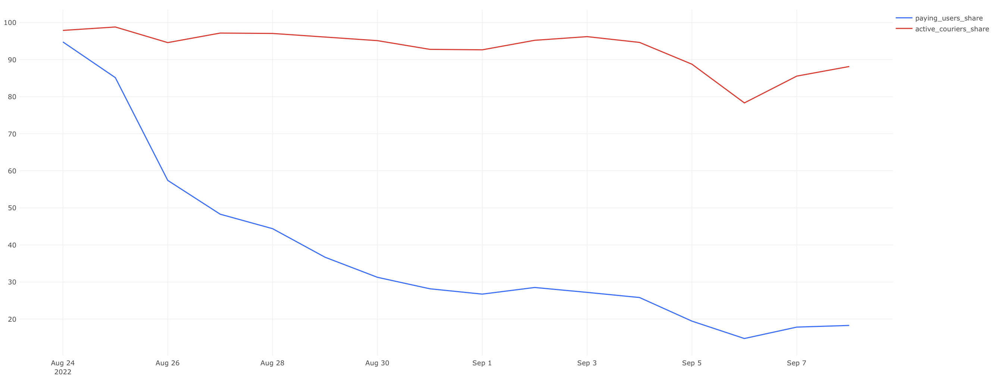
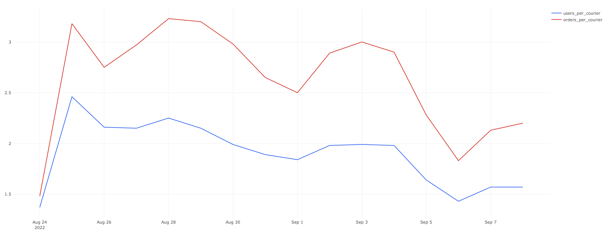

# Статистика заказов, курьеров и пользователей

## Overview

## Link to the Dashboard
[Ссылка для просмотра дашборда в Redash](http://redash.public.karpov.courses/public/dashboards/uELDYQAyhgWikU0jkEQLIinCyUfxuqDndewsxSqM?org_slug=default)

<details>
<summary>Просмотр Дашборда прямо здесь</summary>
  


</details>

## Задача 1. Анализ активности пользователей и курьеров по дням

<details>
<summary> Описание задачи</summary>
Для каждого дня, представленного в таблицах `user_actions` и `courier_actions`, необходимо рассчитать следующие показатели:
- Число новых пользователей (`new_users`)
- Число новых курьеров (`new_couriers`)
- Общее число пользователей на текущий день (`total_users`)
- Общее число курьеров на текущий день (`total_couriers`)

Колонки с показателями должны быть названы соответственно. Колонка с датами должна быть названа `date`. Показатели должны быть выражены целыми числами, и результат должен быть отсортирован по возрастанию даты.
</details>

<details>
<summary> SQL запрос</summary>
  
```sql
WITH ua_table AS (
    SELECT
        date,
        COUNT(user_id) AS new_users
    FROM (
        SELECT 
            user_id,
            MIN(time)::DATE AS date
        FROM user_actions
        GROUP BY user_id
        ORDER BY user_id
    ) ua
    GROUP BY date
    ORDER BY date
),

ca_table AS (
    SELECT
        date,
        COUNT(courier_id) AS new_couriers
    FROM (
        SELECT 
            courier_id,
            MIN(time)::DATE AS date
        FROM courier_actions
        GROUP BY courier_id
        ORDER BY courier_id
    ) ca
    GROUP BY date
    ORDER BY date
)

SELECT 
    ua_table.date AS date,
    new_users,
    new_couriers,
    SUM(new_users) OVER (ORDER BY ua_table.date)::INTEGER AS total_users,
    SUM(new_couriers) OVER (ORDER BY ua_table.date)::INTEGER AS total_couriers
FROM ua_table
JOIN ca_table 
ON ua_table.date = ca_table.date
```
</details>

<details>
<summary> Результат выполнения запроса</summary>

| date     | new_users | new_couriers | total_users | total_couriers |
|----------|-----------|--------------|-------------|----------------|
| 24/08/22 | 134       | 95           | 134         | 95             |
| 25/08/22 | 829       | 242          | 963         | 337            |
| 26/08/22 | 1,017     | 219          | 1,980       | 556            |
| 27/08/22 | 1,225     | 186          | 3,205       | 742            |
| 28/08/22 | 1,487     | 213          | 4,692       | 955            |
| 29/08/22 | 1,309     | 109          | 6,001       | 1,064          |
| 30/08/22 | 1,204     | 127          | 7,205       | 1,191          |
| 31/08/22 | 1,420     | 195          | 8,625       | 1,386          |
| 01/09/22 | 1,513     | 205          | 10,138      | 1,591          |
| 02/09/22 | 1,887     | 229          | 12,025      | 1,820          |
| 03/09/22 | 1,924     | 161          | 13,949      | 1,981          |
| 04/09/22 | 1,952     | 205          | 15,901      | 2,186          |
| 05/09/22 | 1,397     | 120          | 17,298      | 2,306          |
| 06/09/22 | 1,020     | 98           | 18,318      | 2,404          |
| 07/09/22 | 1,412     | 220          | 19,730      | 2,624          |
| 08/09/22 | 1,671     | 202          | 21,401      | 2,826          |
</details>

<details>
<summary> Визуализация данных</summary>
  

  

</details>


## Задача 2. Анализ изменений в активности пользователей и курьеров по дням

<details>
<summary>Описание задачи</summary>
Дополните запрос из предыдущего задания. Теперь для каждого дня, представленного в таблицах `user_actions` и `courier_actions`, дополнительно рассчитайте следующие показатели:
- Прирост числа новых пользователей (`new_users_change`)
- Прирост числа новых курьеров (`new_couriers_change`)
- Прирост общего числа пользователей (`total_users_growth`)
- Прирост общего числа курьеров (`total_couriers_growth`)

Включите также показатели, рассчитанные на предыдущем шаге, в результирующую таблицу. Новые колонки с показателями назовите соответственно. Колонка с датами называется `date`. Все показатели прироста считайте в процентах относительно значений в предыдущий день и округляйте значения до двух знаков после запятой.
</details>

<details>
<summary>SQL запрос</summary>
  
```sql
WITH ua_table AS (
    SELECT
        date,
        COUNT(user_id) AS new_users
    FROM (
        SELECT 
            user_id,
            MIN(time)::DATE AS date
        FROM user_actions
        GROUP BY user_id
        ORDER BY user_id
    ) ua
    GROUP BY date
    ORDER BY date
),

ca_table AS (
    SELECT
        date,
        COUNT(courier_id) AS new_couriers
    FROM (
        SELECT 
            courier_id,
            MIN(time)::DATE AS date
        FROM courier_actions
        GROUP BY courier_id
        ORDER BY courier_id
    ) ca
    GROUP BY date
    ORDER BY date
), 

merged_tab AS (
    SELECT 
        ua_table.date AS date,
        new_users,
        new_couriers,
        SUM(new_users) OVER(ORDER BY ua_table.date)::INTEGER AS total_users,
        SUM(new_couriers) OVER(ORDER BY ua_table.date)::INTEGER AS total_couriers
    FROM ua_table
    JOIN ca_table 
    ON ua_table.date = ca_table.date
)

SELECT
    date, 
    new_users,
    ROUND(((new_users - LAG(new_users) OVER())::DECIMAL / LAG(new_users) OVER())*100, 2) AS new_users_change,
    new_couriers,
    ROUND(((new_couriers - LAG(new_couriers) OVER())::DECIMAL / LAG(new_couriers) OVER())*100, 2) AS new_couriers_change,
    total_users,
    ROUND(((total_users - LAG(total_users) OVER())::DECIMAL / LAG(total_users) OVER())*100, 2) AS total_users_growth,
    total_couriers,
    ROUND(((total_couriers - LAG(total_couriers) OVER())::DECIMAL / LAG(total_couriers) OVER())*100, 2) AS total_couriers_growth
FROM merged_tab
```
</details>

<details>
<summary>Результат выполнения запроса</summary>

| date     | new_users | new_users_change | new_couriers | new_couriers_change | total_users | total_users_growth | total_couriers | total_couriers_growth |
|----------|-----------|------------------|--------------|---------------------|-------------|--------------------|----------------|-----------------------|
| 24/08/22 | 134       |                  | 95           |                     | 134         |                    | 95             |                       |
| 25/08/22 | 829       | 518.66           | 242          | 154.74              | 963         | 618.66            | 337            | 254.74                |
| 26/08/22 | 1,017     | 22.68            | 219          | -9.50               | 1,980       | 105.61            | 556            | 64.99                 |
| 27/08/22 | 1,225     | 20.45            | 186          | -15.07              | 3,205       | 61.87             | 742            | 33.45                 |
| 28/08/22 | 1,487     | 21.39            | 213          | 14.52               | 4,692       | 46.40             | 955            | 28.71                 |
| 29/08/22 | 1,309     | -11.97           | 109          | -48.83              | 6,001       | 27.90             | 1,064          | 11.41                 |
| 30/08/22 | 1,204     | -8.02            | 127          | 16.51               | 7,205       | 20.06             | 1,191          | 11.94                 |
| 31/08/22 | 1,420     | 17.94            | 195          | 53.54               | 8,625       | 19.71             | 1,386          | 16.37                 |
| 01/09/22 | 1,513     | 6.55             | 205          | 5.13                | 10,138      | 17.54             | 1,591          | 14.79                 |
| 02/09/22 | 1,887     | 24.72            | 229          | 11.71               | 12,025      | 18.61             | 1,820          | 14.39                 |
| 03/09/22 | 1,924     | 1.96             | 161          | -29.69              | 13,949      | 16.00             | 1,981          | 8.85                  |
| 04/09/22 | 1,952     | 1.46             | 205          | 27.33               | 15,901      | 13.99             | 2,186          | 10.35                 |
| 05/09/22 | 1,397     | -28.43           | 120          | -41.46              | 17,298      | 8.79              | 2,306          | 5.49                  |
| 06/09/22 | 1,020     | -26.99           | 98           | -18.33              | 18,318      | 5.90              | 2,404          | 4.25                  |
| 07/09/22 | 1,412     | 38.43            | 220          | 124.49              | 19,730      | 7.71              | 2,624          | 9.15                  |
| 08/09/22 | 1,671     | 18.34            | 202          | -8.18               | 21,401      | 8.47              | 2,826          | 7.70                  |
</details>

<details>
<summary>Визуализация данных</summary>
  


</details>


## Задача 3. Анализ платящих пользователей и активных курьеров

<details>
<summary>Описание задачи</summary>
Рассмотрите аудиторию с другого угла — посчитайте не просто всех пользователей, а именно ту часть, которая оформляет и оплачивает заказы. Выясните, какую долю платящие пользователи составляют от общего числа пользователей. Аналогично определите долю активных курьеров от общего числа курьеров.

Платящими считаем пользователей, которые оформили хотя бы один заказ, не отменённый в дальнейшем. Курьеры считаются активными, если они приняли или доставили хотя бы один заказ.

Задание включает расчёт:
- Число платящих пользователей.
- Число активных курьеров.
- Доля платящих пользователей в общем числе пользователей.
- Доля активных курьеров в общем числе курьеров.

Показатели долей выражены в процентах и округлены до двух знаков после запятой.
</details>

<details>
<summary>SQL запрос</summary>

```sql
WITH 
users_tab AS (
    SELECT 
        time::DATE AS date, 
        COUNT(DISTINCT user_id) FILTER(WHERE action = 'create_order' AND order_id NOT IN (
            SELECT order_id FROM user_actions WHERE action = 'cancel_order'
        )) AS paying_users
    FROM user_actions
    GROUP BY 1
),

couriers_tab AS (
    SELECT 
        time::DATE AS date, 
        COUNT(DISTINCT courier_id) FILTER(WHERE order_id IN (
            SELECT order_id FROM courier_actions WHERE action = 'deliver_order'
        )) AS active_couriers
    FROM courier_actions
    GROUP BY 1
),

merged_tab AS (
    SELECT
        users_tab.date, paying_users, active_couriers
    FROM users_tab
    JOIN couriers_tab
    USING (date)
),

ua_table AS (
    SELECT
        date,
        COUNT(user_id) AS new_users
    FROM (
        SELECT 
            user_id,
            MIN(time)::DATE AS date
        FROM user_actions
        GROUP BY user_id
        ORDER BY user_id
    ) ua
    GROUP BY date
    ORDER BY date
),

ca_table AS (
    SELECT
        date,
        COUNT(courier_id) AS new_couriers
    FROM (
        SELECT 
            courier_id,
            MIN(time)::DATE AS date
        FROM courier_actions
        GROUP BY courier_id
        ORDER BY courier_id
    ) ca
    GROUP BY date
    ORDER BY date
),

final_tab AS (
    SELECT 
        merged_tab.date, paying_users, active_couriers, 
        SUM(new_users) OVER(ORDER BY ua_table.date)::INTEGER AS total_users,
        SUM(new_couriers) OVER(ORDER BY ua_table.date)::INTEGER AS total_couriers
    FROM merged_tab
    JOIN ua_table 
    USING(date)
    JOIN ca_table
    USING(date)
)

SELECT 
    date,
    paying_users,
    active_couriers,
    ROUND(((paying_users::DECIMAL / total_users)*100), 2) AS paying_users_share,
    ROUND(((active_couriers::DECIMAL / total_couriers)*100), 2) AS active_couriers_share
FROM final_tab
```
</details>

<details>
<summary>Результат выполнения запроса</summary>

| date     | paying_users | active_couriers | paying_users_share | active_couriers_share |
|----------|--------------|-----------------|--------------------|-----------------------|
| 24/08/22 | 127          | 93              | 94.78              | 97.89                 |
| 25/08/22 | 820          | 333             | 85.15              | 98.81                 |
| 26/08/22 | 1,137        | 526             | 57.42              | 94.60                 |
| 27/08/22 | 1,548        | 721             | 48.30              | 97.17                 |
| 28/08/22 | 2,083        | 927             | 44.39              | 97.07                 |
| 29/08/22 | 2,202        | 1,022           | 36.69              | 96.05                 |
| 30/08/22 | 2,253        | 1,133           | 31.27              | 95.13                 |
| 31/08/22 | 2,430        | 1,286           | 28.17              | 92.78                 |
| 01/09/22 | 2,710        | 1,474           | 26.73              | 92.65                 |
| 02/09/22 | 3,429        | 1,733           | 28.52              | 95.22                 |
| 03/09/22 | 3,794        | 1,906           | 27.20              | 96.21                 |
| 04/09/22 | 4,104        | 2,069           | 25.81              | 94.65                 |
| 05/09/22 | 3,362        | 2,047           | 19.44              | 88.77                 |
| 06/09/22 | 2,701        | 1,883           | 14.75              | 78.33                 |
| 07/09/22 | 3,517        | 2,245           | 17.83              | 85.56                 |
| 08/09/22 | 3,912        | 2,491           | 18.28              | 88.15                 |
</details>

<details>
<summary>Визуализация данных</summary>
  




</details>


## Задача 4. Анализ поведения платящих пользователей: один заказ против нескольких за день

<details>
<summary>Описание задачи</summary>
Исследуйте, сколько платящих пользователей совершают более одного заказа в день. Определите долю пользователей, совершающих один заказ, и долю тех, кто делает несколько заказов в день, от общего числа платящих пользователей. Это поможет понять, насколько наш сервис мотивирует пользователей к повторным заказам в течение одного дня.

Платящими считаем пользователей, которые в этот день оформили (и не отменили) хотя бы один заказ.
</details>

<details>
<summary>SQL запрос</summary>

```sql
WITH 
sq AS (
    SELECT
        date,
        COUNT(user_id) FILTER(WHERE orders_count = 1) AS single_order_users,
        COUNT(user_id) FILTER(WHERE orders_count > 1) AS several_orders_users
    FROM (
        SELECT 
            user_id,
            time::DATE AS date,
            COUNT(order_id) AS orders_count
        FROM user_actions
        WHERE action = 'create_order' AND order_id NOT IN (
            SELECT order_id FROM user_actions WHERE action = 'cancel_order'
        )
        GROUP BY time::DATE, user_id
    ) t1
    GROUP BY date
    ORDER BY date
), 

users_tab AS (
    SELECT 
        time::DATE AS date, 
        COUNT(DISTINCT user_id) FILTER(WHERE action = 'create_order' AND order_id NOT IN (
            SELECT order_id FROM user_actions WHERE action = 'cancel_order'
        )) AS paying_users
    FROM user_actions
    GROUP BY 1
)

SELECT 
    sq.date,
    ROUND(((single_order_users::DECIMAL / paying_users) * 100), 2) AS single_order_users_share,
    ROUND(((several_orders_users::DECIMAL / paying_users) * 100), 2) AS several_orders_users_share
FROM sq
JOIN users_tab
USING(date)
```
</details>

<details>
<summary>Результат выполнения запроса</summary>

| date     | single_order_users_share | several_orders_users_share |
|----------|--------------------------|----------------------------|
| 24/08/22 | 92.91                    | 7.09                       |
| 25/08/22 | 76.46                    | 23.54                      |
| 26/08/22 | 78.45                    | 21.55                      |
| 27/08/22 | 70.93                    | 29.07                      |
| 28/08/22 | 67.83                    | 32.17                      |
| 29/08/22 | 65.58                    | 34.42                      |
| 30/08/22 | 64.67                    | 35.33                      |
| 31/08/22 | 70.41                    | 29.59                      |
| 01/09/22 | 71.70                    | 28.30                      |
| 02/09/22 | 67.02                    | 32.98                      |
| 03/09/22 | 63.94                    | 36.06                      |
| 04/09/22 | 65.94                    | 34.06                      |
| 05/09/22 | 69.96                    | 30.04                      |
| 06/09/22 | 77.67                    | 22.33                      |
| 07/09/22 | 72.65                    | 27.35                      |
| 08/09/22 | 69.61                    | 30.39                      |
</details>

<details>
<summary>Визуализация данных</summary>
  


</details>


## Задача 5. Анализ заказов: первые заказы и заказы новых пользователей

<details>
<summary>Описание задачи</summary>
Изучим заказы на нашем сервисе, уделив внимание первым заказам пользователей и заказам, совершенным новыми пользователями в их первый день использования сервиса. Оценим долю этих заказов от общего числа заказов за каждый день.

- **Первые заказы** — это заказы, сделанные пользователями впервые.
- **Заказы новых пользователей** — это заказы, сделанные пользователями в тот же день, когда они впервые воспользовались сервисом. Учитывайте, что новый пользователь может совершить несколько заказов в первый день.

При расчётах не учитывайте отменённые заказы.
</details>

<details>
<summary>SQL запрос</summary>

```sql
WITH tot_or AS (
    SELECT 
        time::DATE AS date,
        COUNT(order_id) AS orders
    FROM user_actions
    WHERE order_id NOT IN (SELECT order_id FROM user_actions WHERE action = 'cancel_order')
    GROUP BY time::DATE
    ORDER BY 1
),

f_o AS (
    SELECT
        min_time::DATE AS date,
        COUNT(user_id) AS first_orders
    FROM (
        SELECT 
            user_id,
            MIN(time) AS min_time
        FROM user_actions
        WHERE order_id NOT IN (SELECT order_id FROM user_actions WHERE action = 'cancel_order')
        GROUP BY user_id
    ) min_order_time
    GROUP BY min_time::DATE
    ORDER BY date
),

n_u_o AS (
    SELECT
        date, 
        SUM(users_orders)::INTEGER AS new_users_orders
    FROM (
        SELECT
            t1.user_id, t1.date AS date, COALESCE(orders_count, 0) AS users_orders
        FROM (
            SELECT
                user_id,
                MIN(time)::DATE AS date
            FROM user_actions
            GROUP BY user_id
        ) t1
        LEFT JOIN (
            SELECT
                COUNT(order_id) AS orders_count,
                time::DATE AS date, 
                user_id
            FROM user_actions
            WHERE order_id NOT IN (SELECT order_id FROM user_actions WHERE action = 'cancel_order')
            GROUP BY time::DATE, user_id
            ORDER BY user_id
        ) t2
        USING(date, user_id)
        ORDER BY orders_count
    ) t3
    GROUP BY date
    ORDER BY date
)

SELECT
    tot_or.date AS date,
    orders,
    first_orders,
    new_users_orders,
    ROUND(((first_orders::DECIMAL / orders) * 100), 2) AS first_orders_share,
    ROUND(((new_users_orders::DECIMAL / orders) * 100),  2) AS new_users_orders_share
FROM tot_or
JOIN f_o
USING(date)
JOIN n_u_o
USING(date)
```
</details>

<details>
<summary>Результат выполнения запроса</summary>

| date     | orders | first_orders | new_users_orders | first_orders_share | new_users_orders_share |
|----------|--------|--------------|------------------|--------------------|------------------------|
| 24/08/22 | 138    | 127          | 138              | 92.03              | 100.00                 |
| 25/08/22 | 1,059  | 802          | 1,032            | 75.73              | 97.45                  |
| 26/08/22 | 1,447  | 984          | 1,250            | 68.00              | 86.39                  |
| 27/08/22 | 2,141  | 1,192        | 1,624            | 55.67              | 75.85                  |
| 28/08/22 | 2,998  | 1,460        | 2,102            | 48.70              | 70.11                  |
| 29/08/22 | 3,267  | 1,281        | 1,832            | 39.21              | 56.08                  |
| 30/08/22 | 3,371  | 1,180        | 1,714            | 35.00              | 50.85                  |
| 31/08/22 | 3,410  | 1,380        | 1,908            | 40.47              | 55.95                  |
| 01/09/22 | 3,688  | 1,492        | 1,988            | 40.46              | 53.90                  |
| 02/09/22 | 5,001  | 1,864        | 2,655            | 37.27              | 53.09                  |
| 03/09/22 | 5,709  | 1,907        | 2,830            | 33.40              | 49.57                  |
| 04/09/22 | 6,010  | 1,943        | 2,763            | 32.33              | 45.97                  |
| 05/09/22 | 4,675  | 1,387        | 1,865            | 29.67              | 39.89                  |
| 06/09/22 | 3,451  | 1,012        | 1,264            | 29.32              | 36.63                  |
| 07/09/22 | 4,777  | 1,416        | 1,865            | 29.64              | 39.04                  |
| 08/09/22 | 5,474  | 1,661        | 2,300            | 30.34              | 42.02                  |
</details>

<details>
<summary>Визуализация данных</summary>
  


</details>


## Задача 6. Оценка нагрузки на курьеров: пользователи и заказы на курьера

<details>
<summary>Описание задачи</summary>
Оцените нагрузку на активных курьеров, рассчитав количество платящих пользователей и неотменённых заказов, приходящихся на каждого курьера за каждый день. Эти метрики помогут понять, насколько эффективно распределяются задачи среди курьеров.

- **Платящие пользователи** — те, кто оформил и не отменил заказ в течение дня.
- **Активные курьеры** — те, кто принял или доставил хотя бы один заказ в течение дня.
</details>

<details>
<summary>SQL запрос</summary>
  
```sql
SELECT 
    date,
    ROUND((paying_users::DECIMAL / active_couriers), 2) AS users_per_courier,
    ROUND((orders_per_date::DECIMAL / active_couriers), 2) AS orders_per_courier
FROM
    (SELECT time::DATE AS date, COUNT(DISTINCT courier_id) FILTER(WHERE order_id IN (
        SELECT order_id FROM courier_actions WHERE action = 'deliver_order'
    )) AS active_couriers
    FROM courier_actions
    GROUP BY time::DATE) active_couriers_tab
LEFT JOIN
    (SELECT time::DATE as date, COUNT(DISTINCT user_id) FILTER(WHERE action = 'create_order' AND order_id NOT IN (
        SELECT order_id FROM user_actions WHERE action = 'cancel_order'
    )) AS paying_users
    FROM user_actions
    GROUP BY time::DATE) paying_users_tab
USING(date)
LEFT JOIN
    (SELECT creation_time::DATE AS date, COUNT(order_id) FILTER(WHERE order_id NOT IN (
        SELECT order_id FROM user_actions WHERE action='cancel_order'
    )) AS orders_per_date
    FROM orders
    GROUP BY creation_time::DATE) orders_tab
USING(date)
```
</details>

<details>
<summary>Результат выполнения запроса</summary>

| date     | users_per_courier | orders_per_courier |
|----------|-------------------|--------------------|
| 24/08/22 | 1.37              | 1.48               |
| 25/08/22 | 2.46              | 3.18               |
| 26/08/22 | 2.16              | 2.75               |
| 27/08/22 | 2.15              | 2.97               |
| 28/08/22 | 2.25              | 3.23               |
| 29/08/22 | 2.15              | 3.20               |
| 30/08/22 | 1.99              | 2.98               |
| 31/08/22 | 1.89              | 2.65               |
| 01/09/22 | 1.84              | 2.50               |
| 02/09/22 | 1.98              | 2.89               |
| 03/09/22 | 1.99              | 3.00               |
| 04/09/22 | 1.98              | 2.90               |
| 05/09/22 | 1.64              | 2.28               |
| 06/09/22 | 1.43              | 1.83               |
| 07/09/22 | 1.57              | 2.13               |
| 08/09/22 | 1.57              | 2.20               |
</details>

<details>
<summary>Визуализация данных</summary>
  


</details>


## Задача 7. Анализ почасовой нагрузки и доля отмен заказов

<details>
<summary>Описание задачи</summary>
Изучим почасовую активность пользователей и выясним, в какие часы суток оформляется больше всего заказов. Также проанализируем долю отмененных заказов по часам, чтобы понять, в какое время суток чаще всего происходят отмены.

- **Успешные заказы** — заказы, которые были доставлены.
- **Отмененные заказы** — заказы, которые были отменены пользователем или по другим причинам.
</details>

<details>
<summary>SQL запрос</summary>
  
```sql
SELECT hour, successful_orders, canceled_orders,
ROUND(canceled_orders::DECIMAL / (successful_orders + canceled_orders), 3) AS cancel_rate
FROM
    (SELECT DATE_PART('hour', creation_time)::INTEGER AS hour, 
    COUNT(order_id) FILTER(WHERE order_id IN (SELECT order_id FROM courier_actions WHERE action = 'deliver_order')) AS successful_orders,
    COUNT(order_id) FILTER(WHERE order_id IN (SELECT order_id FROM user_actions WHERE action = 'cancel_order')) AS canceled_orders
    FROM orders
    GROUP BY DATE_PART('hour', creation_time)::INTEGER
    ORDER BY 1) t1
```
</details>

<details>
<summary>Результат выполнения запроса</summary>

| hour | successful_orders | canceled_orders | cancel_rate |
|------|-------------------|-----------------|-------------|
| 0    | 2,297             | 139             | 0.060       |
| 1    | 1,867             | 98              | 0.050       |
| 2    | 1,422             | 62              | 0.040       |
| 3    | 958               | 56              | 0.060       |
| 4    | 926               | 48              | 0.050       |
| 5    | 1,363             | 77              | 0.050       |
| 6    | 1,583             | 101             | 0.060       |
| 7    | 2,101             | 100             | 0.050       |
| 8    | 2,195             | 117             | 0.050       |
| 9    | 2,606             | 151             | 0.060       |
| 10   | 2,641             | 135             | 0.050       |
| 11   | 2,584             | 121             | 0.050       |
| 12   | 2,440             | 124             | 0.050       |
| 13   | 2,424             | 122             | 0.050       |
| 14   | 2,351             | 120             | 0.050       |
| 15   | 2,513             | 128             | 0.050       |
| 16   | 2,480             | 158             | 0.060       |
| 17   | 2,966             | 168             | 0.050       |
| 18   | 3,149             | 162             | 0.050       |
| 19   | 3,496             | 189             | 0.050       |
| 20   | 3,414             | 163             | 0.050       |
| 21   | 3,197             | 172             | 0.050       |
| 22   | 2,978             | 127             | 0.040       |
| 23   | 2,665             | 141             | 0.050       |
</details>

<details>
<summary>Визуализация данных</summary>
  


</details>


## Задача 8. Анализ среднего времени доставки заказов курьерами

<details>
<summary>Описание задачи</summary>
Оценим эффективность работы курьеров, рассчитав среднее время доставки заказов. Этот показатель поможет понять, насколько оперативно курьеры справляются с их основной задачей — доставкой заказов до клиентов.

- **Среднее время доставки** выражено в минутах.
- Учитываются только заказы, которые были доставлены, без учёта отменённых заказов.
</details>

<details>
<summary>SQL запрос</summary>
  
```sql
SELECT delivery_date::DATE AS date,
ROUND(AVG(deliver_during))::INTEGER AS minutes_to_deliver
FROM
    (SELECT
        order_id, 
        courier_id,
        EXTRACT(epoch FROM (MAX(time) - MIN(time))) / 60 AS deliver_during,
        MAX(time) AS delivery_date
    FROM courier_actions
    WHERE order_id NOT IN (SELECT order_id FROM user_actions WHERE action = 'cancel_order')
    GROUP BY order_id, courier_id
    ORDER BY order_id) t1
GROUP BY delivery_date::DATE
ORDER BY date
```
</details>

<details>
<summary>Результат выполнения запроса</summary>

| date     | minutes_to_deliver |
|----------|--------------------|
| 24/08/22 | 20                 |
| 25/08/22 | 20                 |
| 26/08/22 | 20                 |
| 27/08/22 | 20                 |
| 28/08/22 | 20                 |
| 29/08/22 | 20                 |
| 30/08/22 | 20                 |
| 31/08/22 | 20                 |
| 01/09/22 | 20                 |
| 02/09/22 | 20                 |
| 03/09/22 | 20                 |
| 04/09/22 | 20                 |
| 05/09/22 | 20                 |
| 06/09/22 | 20                 |
| 07/09/22 | 20                 |
| 08/09/22 | 20                 |
</details>

<details>
<summary>Визуализация данных</summary>
  


</details>

