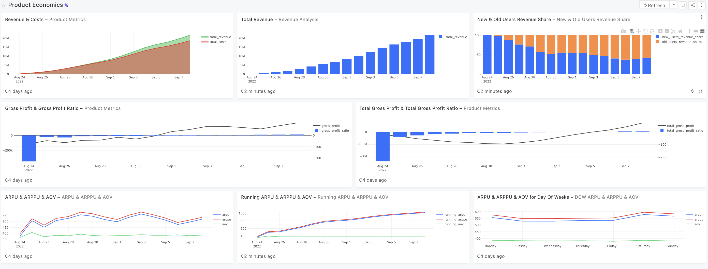
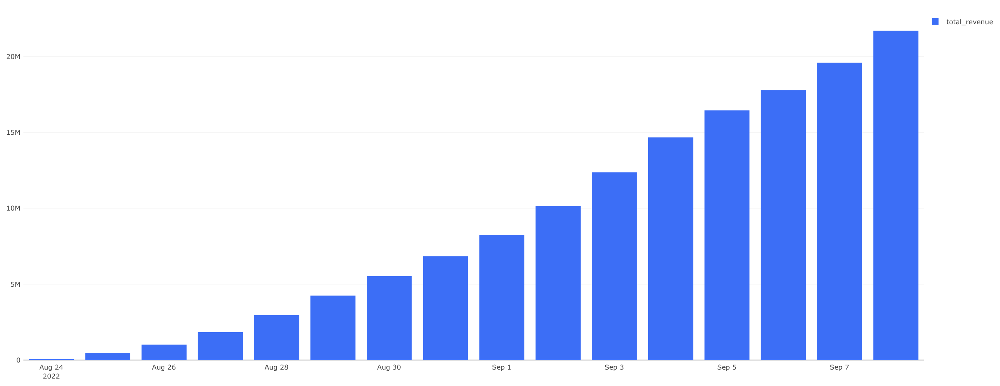
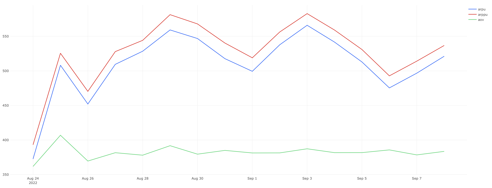
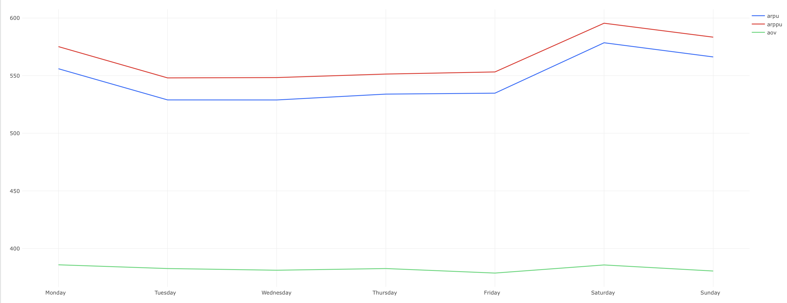
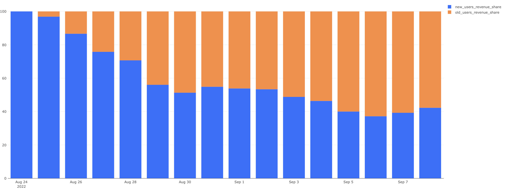
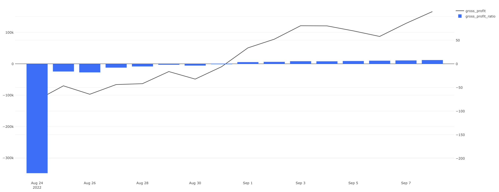
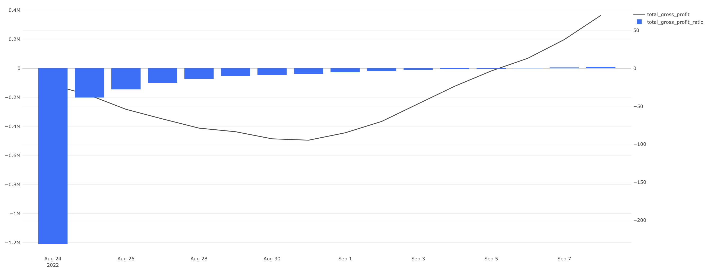
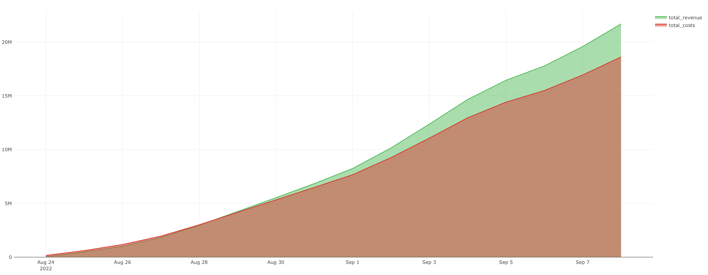

# Экономика Продукта

## Overview

## Link to the Dashboard
[Ссылка для просмотра дашборда в Redash](http://redash.public.karpov.courses/public/dashboards/8TnZ2y1HOfjWa0U2x0Y5v2ldHn3HOQAkG5ljbSmG?org_slug=default)

<details>
<summary>Просмотр Дашборда прямо здесь</summary>
  

</details>


## Задача 1. Анализ ежедневной выручки и её динамики

<details>
<summary>Описание задачи</summary>
Изучим выручку нашего сервиса за каждый день, накопленную выручку на текущий день и прирост дневной выручки относительно предыдущего дня. Эти показатели помогут оценить общий финансовый успех и динамику развития нашего сервиса.

- **Выручка за день** — сумма оплаченных заказов за каждый день.
- **Суммарная выручка** — накопительная сумма выручки с начала учёта.
- **Прирост выручки** — изменение выручки по сравнению с предыдущим днем, выраженное в процентах.

В расчётах не учитываются отменённые заказы.
</details>

<details>
<summary>SQL запрос</summary>
  
```sql
SELECT 
    date,
    revenue,
    SUM(revenue) OVER(ORDER BY date) AS total_revenue,
    ROUND(((revenue - LAG(revenue) OVER())::DECIMAL / LAG(revenue) OVER())*100, 2) AS revenue_change
FROM 
    (SELECT 
        creation_time::DATE AS date, 
        SUM(order_price) AS revenue
    FROM
        (SELECT order_id, creation_time, SUM(price) AS order_price
        FROM
            (SELECT order_id, creation_time, unnest(product_ids) AS product_id
            FROM orders
            WHERE order_id NOT IN (SELECT order_id FROM user_actions WHERE action = 'cancel_order')) t1
        LEFT JOIN products
        USING(product_id)
        GROUP BY creation_time, order_id) t2
    GROUP BY creation_time::DATE
    ORDER BY 1) t3
```
</details>

<details>
<summary>Результат выполнения запроса</summary>

| date     | revenue     | total_revenue | revenue_change |
|----------|-------------|---------------|----------------|
| 24/08/22 | $49,924.00  | $49,924.00    |                |
| 25/08/22 | $430,860.00 | $480,784.00   | 763.03%        |
| 26/08/22 | $534,766.00 | $1,015,550.00 | 24.12%         |
| 27/08/22 | $817,053.00 | $1,832,603.00 | 52.79%         |
| 28/08/22 | $1,133,370.00 | $2,965,973.00 | 38.71%     |
| 29/08/22 | $1,279,891.00 | $4,245,864.00 | 12.93%     |
| 30/08/22 | $1,279,377.00 | $5,525,241.00 | -0.04%     |
| 31/08/22 | $1,312,720.00 | $6,837,961.00 | 2.61%      |
| 01/09/22 | $1,406,101.00 | $8,244,062.00 | 7.11%      |
| 02/09/22 | $1,907,107.00 | $10,151,169.00 | 35.63%    |
| 03/09/22 | $2,210,988.00 | $12,362,157.00 | 15.93%    |
| 04/09/22 | $2,294,009.00 | $14,656,166.00 | 3.75%     |
| 05/09/22 | $1,784,690.00 | $16,440,856.00 | -22.20%   |
| 06/09/22 | $1,330,931.00 | $17,771,787.00 | -25.43%   |
| 07/09/22 | $1,807,800.00 | $19,579,587.00 | 35.83%    |
| 08/09/22 | $2,099,508.00 | $21,679,095.00 | 16.14%    |
</details>

<details>
<summary>Визуализация данных</summary>
  

</details>


## Задача 2. Анализ ежедневной выручки по пользователям и заказам

<details>
<summary>Описание задачи</summary>
Исследуем, сколько в среднем приносит выручку каждый пользователь и каждый заказ на нашем сервисе, а также оценим среднюю выручку от платящих пользователей. Эти показатели позволят понять, насколько выгодно пользователям пользоваться услугами сервиса и насколько эффективно сервис привлекает к оплате.

- **ARPU (Average Revenue Per User)** — средняя выручка на одного пользователя.
- **ARPPU (Average Revenue Per Paying User)** — средняя выручка на одного платящего пользователя.
- **AOV (Average Order Value)** — средний чек или средняя выручка на заказ.
</details>

<details>
<summary>SQL запрос</summary>

```sql
WITH sq_1 AS (
    SELECT creation_time::DATE AS date, SUM(order_price) AS daily_revenue, COUNT(order_id) AS daily_orders
    FROM (
        SELECT order_id, creation_time, SUM(price) AS order_price
        FROM (
            SELECT order_id, creation_time, unnest(product_ids) AS product_id
            FROM orders
            WHERE order_id NOT IN (SELECT order_id FROM user_actions WHERE action = 'cancel_order')
        ) ords
        LEFT JOIN products USING(product_id)
        GROUP BY order_id, creation_time
    ) orders_tab
    GROUP BY 1
    ORDER BY 1
),

sq_2 AS (
    SELECT time::DATE as DATE, 
    COUNT(DISTINCT user_id) FILTER (WHERE order_id NOT IN (SELECT order_id FROM user_actions WHERE action = 'cancel_order')) AS paying_users,
    COUNT(DISTINCT user_id) AS total_users 
    FROM user_actions
    GROUP BY 1
)

SELECT 
    sq_1.date AS date, 
    ROUND((daily_revenue::DECIMAL / total_users), 2) AS arpu,
    ROUND((daily_revenue::DECIMAL / paying_users), 2) AS arppu,
    ROUND((daily_revenue::DECIMAL / daily_orders), 2) AS aov
FROM sq_1
JOIN sq_2
USING(date)
```
</details>

<details>
<summary>Результат выполнения запроса</summary>

| date     | arpu   | arppu  | aov    |
|----------|--------|--------|--------|
| 24/08/22 | 372.57 | 393.10 | 361.77 |
| 25/08/22 | 508.09 | 525.44 | 406.86 |
| 26/08/22 | 452.04 | 470.33 | 369.57 |
| 27/08/22 | 509.38 | 527.81 | 381.62 |
| 28/08/22 | 528.38 | 544.10 | 378.04 |
| 29/08/22 | 559.15 | 581.24 | 391.76 |
| 30/08/22 | 546.74 | 567.85 | 379.52 |
| 31/08/22 | 517.63 | 540.21 | 384.96 |
| 01/09/22 | 499.33 | 518.86 | 381.26 |
| 02/09/22 | 537.67 | 556.17 | 381.35 |
| 03/09/22 | 565.90 | 582.76 | 387.28 |
| 04/09/22 | 541.55 | 558.97 | 381.70 |
| 05/09/22 | 512.84 | 530.84 | 381.75 |
| 06/09/22 | 475.33 | 492.75 | 385.67 |
| 07/09/22 | 496.65 | 514.02 | 378.44 |
| 08/09/22 | 521.10 | 536.68 | 383.54 |
</details>

<details>
<summary>Визуализация данных</summary>
  


</details>


## Задача 3. Анализ динамических показателей выручки на пользователя и заказ

<details>
<summary>Описание задачи</summary>
Рассчитаем динамические показатели выручки на пользователя и на заказ по дням, включая накопленные данные. Это поможет отслеживать изменения в эффективности привлечения и монетизации пользователей, а также в среднем чеке заказов на протяжении времени.

- **Running ARPU (Average Revenue Per User)** — накопленная средняя выручка на одного пользователя.
- **Running ARPPU (Average Revenue Per Paying User)** — накопленная средняя выручка на одного платящего пользователя.
- **Running AOV (Average Order Value)** — накопленный средний чек за заказ.
</details>

<details>
<summary>SQL запрос</summary>
  
```sql
WITH sq_1 AS (
    SELECT creation_time::DATE AS date, 
           SUM(order_price) AS daily_revenue, 
           COUNT(order_id) AS daily_orders,
           SUM(SUM(order_price)) OVER(ORDER BY creation_time::DATE) AS accumulated_revenue,
           SUM(COUNT(order_id)) OVER(ORDER BY creation_time::DATE) AS accumulated_daily_orders
    FROM (
        SELECT order_id, creation_time, SUM(price) AS order_price
        FROM (
            SELECT order_id, creation_time, unnest(product_ids) AS product_id
            FROM orders
            WHERE order_id NOT IN (SELECT order_id FROM user_actions WHERE action = 'cancel_order')
        ) ords
        LEFT JOIN products USING(product_id)
        GROUP BY order_id, creation_time
    ) orders_tab
    GROUP BY 1
    ORDER BY 1
),

sq_2 AS (
    SELECT tu.date, accumulated_total_users, accumulated_paying_users
    FROM (
        SELECT date, COUNT(user_id) AS users_reged_per_day, 
               SUM(COUNT(user_id)) OVER(ORDER BY date) AS accumulated_total_users
        FROM (
            SELECT MIN(time)::DATE AS date, user_id
            FROM user_actions
            GROUP BY user_id
        ) users_first_date
        GROUP BY date 
        ORDER BY date
    ) tu 
    JOIN (
        SELECT date, COUNT(user_id) paying_users_reged_per_day, 
               SUM(COUNT(user_id)) OVER(ORDER BY date) AS accumulated_paying_users
        FROM (
            SELECT MIN(time)::DATE AS date, user_id
            FROM user_actions
            WHERE order_id NOT IN (SELECT order_id FROM user_actions WHERE action = 'cancel_order')
            GROUP BY user_id
        ) paying_users_first_date
        GROUP BY date
        ORDER BY date
    ) pu USING(date)
)

SELECT 
    sq_1.date AS date, 
    ROUND((accumulated_revenue::DECIMAL / accumulated_total_users), 2) AS running_arpu,
    ROUND((accumulated_revenue::DECIMAL / accumulated_paying_users), 2) AS running_arppu,
    ROUND((accumulated_revenue::DECIMAL / accumulated_daily_orders), 2) AS running_aov
FROM sq_1
JOIN sq_2 USING(date)
```
</details>

<details>
<summary>Результат выполнения запроса</summary>

| date     | running_arpu | running_arppu | running_aov |
|----------|--------------|---------------|-------------|
| 24/08/22 | 372.57       | 393.10        | 361.77      |
| 25/08/22 | 499.26       | 517.53        | 401.66      |
| 26/08/22 | 512.90       | 530.87        | 384.10      |
| 27/08/22 | 571.80       | 590.21        | 382.99      |
| 28/08/22 | 632.13       | 649.72        | 381.08      |
| 29/08/22 | 707.53       | 726.29        | 384.24      |
| 30/08/22 | 766.86       | 786.40        | 383.14      |
| 31/08/22 | 792.81       | 813.46        | 383.49      |
| 01/09/22 | 813.18       | 832.90        | 383.11      |
| 02/09/22 | 844.17       | 863.05        | 382.77      |
| 03/09/22 | 886.24       | 904.39        | 383.57      |
| 04/09/22 | 921.71       | 938.78        | 383.28      |
| 05/09/22 | 950.45       | 967.17        | 383.11      |
| 06/09/22 | 970.18       | 986.72        | 383.30      |
| 07/09/22 | 992.38       | 1,007.85      | 382.85      |
| 08/09/22 | 1,012.99     | 1,028.03      | 382.91      |
</details>


<details>
<summary>Визуализация данных</summary>


</details>


## Задача 4. Анализ средних показателей выручки по дням недели

<details>
<summary>Описание задачи</summary>
Анализируем средние показатели выручки на пользователя и на заказ по дням недели, используя данные за период с 26 августа по 8 сентября 2022 года. Это позволит увидеть, как варьируются расходы пользователей в зависимости от дня недели.

- **ARPU (Average Revenue Per User)** — средняя выручка на одного пользователя за день недели.
- **ARPPU (Average Revenue Per Paying User)** — средняя выручка на одного платящего пользователя за день недели.
- **AOV (Average Order Value)** — средний чек за день недели.
</details>

<details>
<summary>SQL запрос</summary>
  
```sql
WITH sq_1 AS (
    SELECT DATE_PART('isodow', creation_time) AS weekday_number, to_char(creation_time, 'Day') AS weekday, 
           SUM(order_price) AS daily_revenue, COUNT(order_id) AS daily_orders
    FROM (
        SELECT order_id, creation_time, SUM(price) AS order_price
        FROM (
            SELECT order_id, creation_time, unnest(product_ids) AS product_id
            FROM orders
            WHERE order_id NOT IN (SELECT order_id FROM user_actions WHERE action = 'cancel_order')
        ) ords
        LEFT JOIN products USING(product_id)
        GROUP BY order_id, creation_time
    ) orders_tab
    WHERE creation_time BETWEEN '2022-08-26' AND '2022-09-09'
    GROUP BY 1, 2
    ORDER BY 1
),

sq_2 AS (
    SELECT DATE_PART('isodow', time) AS weekday_number, to_char(time, 'Day') AS weekday, 
           COUNT(DISTINCT user_id) FILTER (WHERE order_id NOT IN (SELECT order_id FROM user_actions WHERE action = 'cancel_order')) AS paying_users,
           COUNT(DISTINCT user_id) AS total_users 
    FROM user_actions
    WHERE time BETWEEN '2022-08-26' AND '2022-09-09'
    GROUP BY 1, 2
)

SELECT 
    sq_1.weekday_number AS weekday_number, sq_1.weekday AS weekday,
    ROUND((daily_revenue::DECIMAL / total_users), 2) AS arpu,
    ROUND((daily_revenue::DECIMAL / paying_users), 2) AS arppu,
    ROUND((daily_revenue::DECIMAL / daily_orders), 2) AS aov
FROM sq_1
JOIN sq_2 USING(weekday_number, weekday)
```
</details>

<details>
<summary>Результат выполнения запроса</summary>

| weekday_number | weekday  | arpu   | arppu  | aov    |
|----------------|----------|--------|--------|--------|
| 1              | Monday   | 555.98 | 575.18 | 385.87 |
| 2              | Tuesday  | 528.94 | 548.04 | 382.63 |
| 3              | Wednesday| 528.90 | 548.33 | 381.16 |
| 4              | Thursday | 533.98 | 551.37 | 382.62 |
| 5              | Friday   | 534.79 | 553.21 | 378.70 |
| 6              | Saturday | 578.53 | 595.48 | 385.74 |
| 7              | Sunday   | 566.23 | 583.38 | 380.48 |
</details>

<details>
<summary>Визуализация данных</summary>
  

</details>


## Задача 5. Анализ выручки от новых и старых пользователей

<details>
<summary>Описание задачи</summary>
Рассчитаем выручку с заказов, сделанных новыми пользователями в их первый день использования сервиса, и сравним её с общей выручкой за день. Также определим долю выручки от новых пользователей относительно всей выручки и соответствующую долю от старых пользователей.

- **Выручка за день** — сумма всех успешных заказов за день.
- **Выручка от новых пользователей** — сумма заказов, сделанных пользователями в день их первого использования сервиса.
- **Доля выручки от новых пользователей** и **старых пользователей** — процентная доля выручки от новых и старых пользователей соответственно.
</details>

<details>
<summary>SQL запрос</summary>
  
```sql
WITH rev AS (
    SELECT date, SUM(order_price) AS revenue
    FROM (
        SELECT creation_time::DATE AS date, order_id, SUM(price) AS order_price
        FROM (
            SELECT order_id, creation_time, unnest(product_ids) AS product_id
            FROM orders
            WHERE order_id NOT IN (SELECT order_id FROM user_actions WHERE action = 'cancel_order')
        ) exploded
        LEFT JOIN products USING(product_id)
        GROUP BY creation_time::DATE, order_id
    ) total_tab
    GROUP BY date
),

nu_rev AS (
    SELECT date, SUM(order_price) AS new_users_revenue
    FROM (
        SELECT date, user_id, order_id, SUM(price) AS order_price
        FROM (
            SELECT date, user_id, t2.order_id AS order_id, unnest(product_ids) AS product_id, action
            FROM (
                SELECT date, user_id, order_id, action
                FROM (
                    SELECT user_id, time::DATE AS date, order_id, MIN(TIME::DATE) OVER(PARTITION BY user_id) AS first_order_date, action
                    FROM user_actions
                ) t1
                WHERE date = first_order_date
            ) t2
            LEFT JOIN orders USING(order_id)
        ) t3
        LEFT JOIN products USING(product_id)
        GROUP BY date, user_id, order_id, action
        WHERE order_id NOT IN (SELECT order_id FROM user_actions WHERE action = 'cancel_order')
    ) t4
    GROUP BY date
)

SELECT rev.date, revenue, new_users_revenue, 
ROUND((new_users_revenue / revenue) * 100, 2) AS new_users_revenue_share,
ROUND(100 - ((new_users_revenue / revenue) * 100), 2) AS old_users_revenue_share
FROM rev
JOIN nu_rev USING(date)
```
</details>

<details>
<summary>Результат выполнения запроса</summary>

| date     | revenue     | new_users_revenue | new_users_revenue_share | old_users_revenue_share |
|----------|-------------|-------------------|-------------------------|-------------------------|
| 24/08/22 | $49,924.00  | $49,924.00        | 100.00%                 | 0.00%                   |
| 25/08/22 | $430,860.00 | $417,333.00       | 96.86%                  | 3.14%                   |
| 26/08/22 | $534,766.00 | $463,326.00       | 86.64%                  | 13.36%                  |
| 27/08/22 | $817,053.00 | $619,318.00       | 75.80%                  | 24.20%                  |
| 28/08/22 | $1,133,370.00 | $801,162.00     | 70.69%                  | 29.31%                  |
| 29/08/22 | $1,279,891.00 | $717,374.00     | 56.05%                  | 43.95%                  |
| 30/08/22 | $1,279,377.00 | $656,429.00     | 51.31%                  | 48.69%                  |
| 31/08/22 | $1,312,720.00 | $720,381.00     | 54.88%                  |45.12%                   |
| 01/09/22 | $1,406,101.00 | $757,287.00     | 53.86%                  | 46.14%                  |
| 02/09/22 | $1,907,107.00 | $1,017,824.00   | 53.37%                  | 46.63%                  |
| 03/09/22 | $2,210,988.00 | $1,079,256.00   | 48.81%                  | 51.19%                  |
| 04/09/22 | $2,294,009.00 | $1,063,997.00   | 46.38%                  | 53.62%                  |
| 05/09/22 | $1,784,690.00 | $714,459.00     | 40.03%                  | 59.97%                  |
| 06/09/22 | $1,330,931.00 | $495,058.00     | 37.20%                  | 62.80%                  |
| 07/09/22 | $1,807,800.00 | $710,154.00     | 39.28%                  | 60.72%                  |
| 08/09/22 | $2,099,508.00 | $887,959.00     | 42.29%                  | 57.71%                  |
</details>

<details>
<summary>Визуализация данных</summary>
  

</details>


## Задача 6. Анализ выручки по товарам

<details>
<summary>Описание задачи</summary>
Определим, какие товары нашего ассортимента приносят наибольший доход, а также рассчитаем долю каждого товара в общей выручке. Для товаров с незначительной долей создадим общую категорию "ДРУГОЕ".

- **Выручка от товара** — суммарная выручка, полученная от продажи каждого конкретного товара.
- **Доля выручки** — процентная доля выручки от каждого товара в общей выручке.
</details>

<details>
<summary>SQL запрос</summary>
  
```sql
WITH product_revenue AS (
    SELECT product_id, SUM(price) AS revenue
    FROM (
        SELECT order_id, unnest(product_ids) AS product_id
        FROM orders
        WHERE order_id NOT IN (SELECT order_id FROM user_actions WHERE action = 'cancel_order')
    ) exploded
    LEFT JOIN products USING(product_id)
    GROUP BY product_id
),
total_revenue AS (
    SELECT SUM(revenue) AS total_revenue
    FROM product_revenue
),
categorized_revenue AS (
    SELECT products.name AS product_name, product_revenue.revenue,
        CASE
            WHEN (product_revenue.revenue / total_revenue.total_revenue * 100) < 0.5 THEN 'ДРУГОЕ'
            ELSE products.name
        END AS category
    FROM product_revenue
    JOIN products ON product_revenue.product_id = products.product_id
    CROSS JOIN total_revenue
),
final_output AS (
    SELECT category AS product_name, SUM(revenue) AS revenue,
        ROUND((SUM(revenue) / total_revenue.total_revenue * 100), 2) AS share_in_revenue
    FROM categorized_revenue
    JOIN total_revenue
    GROUP BY category
    ORDER BY revenue DESC
)

SELECT product_name, revenue, share_in_revenue
FROM final_output
WHERE product_name != 'ДРУГОЕ'
UNION ALL
SELECT 'ДРУГОЕ' AS product_name, SUM(revenue) AS revenue,
    ROUND((SUM(revenue) / total_revenue.total_revenue * 100), 2) AS share_in_revenue
FROM categorized_revenue
WHERE category = 'ДРУГОЕ'
GROUP BY category
ORDER BY revenue DESC
```
</details>

<details>
<summary>Результат выполнения запроса</summary>

| product_name        | revenue      | share_in_revenue |
|---------------------|--------------|------------------|
| свинина             | $1,353,600.00| 6.24%            |
| ДРУГОЕ              | $1,225,387.00| 5.64%            |
| курица              | $1,171,140.00| 5.40%            |
| масло оливковое     | $1,163,250.00| 5.37%            |
| говядина            | $977,170.00  | 4.51%            |
| баранина            | $709,930.00  | 3.27%            |
| кофе зерновой       | $632,853.00  | 2.92%            |
| сахар               | $587,250.00  | 2.71%            |
| кофе растворимый    | $540,600.00  | 2.49%            |
| сосиски             | $530,550.00  | 2.45%            |
| ...                 | ...          | ...              |
</details>

<details>
<summary>Визуализация данных</summary>
  

</details>


## Задача 7. Анализ валовой прибыли с учетом затрат и налогов

<details>
<summary>Описание задачи</summary>
Оценим валовую прибыль нашего сервиса за каждый день, учитывая выручку, затраты и НДС. Дополнительно рассмотрим как изменяется доля валовой прибыли в общей выручке на протяжении времени.

- **Выручка за день** — сумма всех успешных заказов за день.
- **Затраты за день** — сумма постоянных и переменных издержек за день.
- **Сумма НДС** — налог на добавленную стоимость, рассчитанный для всех продаж за день.
- **Валовая прибыль за день** — выручка за вычетом затрат и НДС.
- **Суммарные показатели** — накопленные значения выручки, затрат, НДС и валовой прибыли.
- **Доля валовой прибыли в выручке** — показывает, какая часть выручки остается после уплаты затрат и налогов.
</details>

<details>
<summary>SQL запрос</summary>
  
```sql
WITH daily_data AS (
    SELECT 
        date,
        SUM(price) AS revenue,
        SUM(case when product_name in ('сахар', 'сухарики', ...) then price / 1.1 * 0.1 else price / 1.2 * 0.2 end) as tax,
        120000 as fixed_costs -- Adjust based on the actual month and conditions
    FROM 
        orders 
    JOIN 
        products ON orders.product_id = products.product_id
    WHERE 
        order_id NOT IN (SELECT order_id FROM user_actions WHERE action = 'cancel_order')
    GROUP BY 
        date
),
variable_costs as (
    SELECT 
        date,
        count(*) * 140 as assembly_cost, -- Cost per assembly
        count(case when delivered = true then 1 end) * 150 as delivery_cost -- Cost per delivery
    FROM 
        orders
    WHERE 
        date BETWEEN '2022-08-01' AND '2022-08-31' -- Adjust based on the actual conditions
    GROUP BY 
        date
),
costs as (
    SELECT 
        date,
        fixed_costs + assembly_cost + delivery_cost as total_costs
    FROM 
        daily_data
    JOIN 
        variable_costs USING(date)
),
profits as (
    SELECT
        daily_data.date,
        revenue,
        total_costs,
        tax,
        revenue - total_costs - tax as gross_profit
    FROM 
        daily_data
    JOIN 
        costs USING(date)
),
cumulative as (
    SELECT 
        date,
        sum(revenue) over (order by date) as total_revenue,
        sum(total_costs) over (order by date) as total_costs,
        sum(tax) over (order by date) as total_tax,
        sum(gross_profit) over (order by date) as total_gross_profit
    FROM 
        profits
),
ratios as (
    SELECT 
        date,
        gross_profit / revenue * 100 as gross_profit_ratio,
        total_gross_profit / total_revenue * 100 as total_gross_profit_ratio
    FROM 
        cumulative
)
SELECT 
    date, 
    revenue, 
    costs, 
    tax, 
    gross_profit, 
    total_revenue, 
    total_costs, 
    total_tax, 
    total_gross_profit, 
    gross_profit_ratio, 
    total_gross_profit_ratio
FROM 
    ratios
ORDER BY 
    date
```
</details>

<details>
<summary>Результат выполнения запроса</summary>

| date     | revenue   | costs    | tax      | gross_profit | total_revenue | total_costs | total_tax | total_gross_profit | gross_profit_ratio | total_gross_profit_ratio |
|----------|-----------|----------|----------|--------------|---------------|-------------|-----------|--------------------|--------------------|--------------------------|
| 24/08/22 | 49,924.00 | 159,120.00| 6,334.09 | -115,530.09  | 49,924.00     | 159,120.00  | 6,334.09  | -115,530.09        | -231.41%           | -231.41%                 |
| 25/08/22 | 430,860.00| 447,560.00| 53,545.01| -70,245.01   | 480,784.00    | 606,680.00  | 59,879.10 | -185,775.10        | -16.30%            | -38.64%                  |
| ...      | ...       | ...       | ...      | ...          | ...           | ...         | ...       | ...                | ...                | ...                      |

</details>

<details>
<summary>Визуализация данных</summary>
  





</details>

